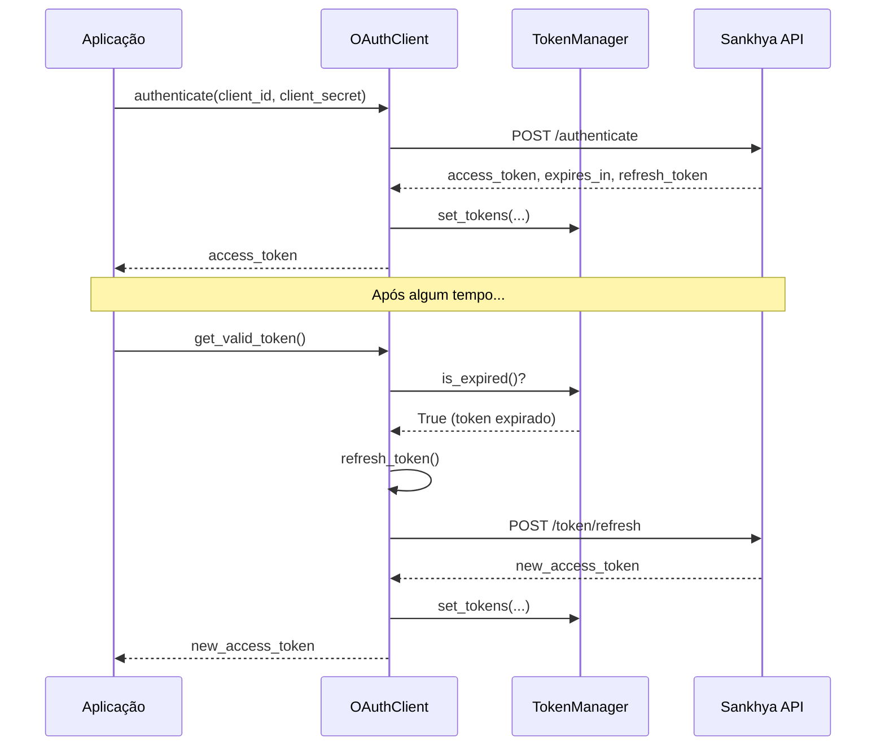

# Autenticação

Módulo de autenticação OAuth2 para o Sankhya SDK.

## Módulo

```python
from sankhya_sdk.auth import OAuthClient, TokenManager
from sankhya_sdk.auth import AuthError, TokenExpiredError, AuthNetworkError
```

---

## OAuthClient

Cliente para interagir com os endpoints OAuth2 do Sankhya.

### Características

| Característica | Descrição |
|----------------|-----------|
| **OAuth2** | Fluxo `client_credentials` padrão |
| **Auto-refresh** | Renovação automática de tokens expirados |
| **X-Token** | Suporte a token proprietário Sankhya |
| **Thread-safe** | Via `TokenManager` interno |

### Construtor

```python
OAuthClient(
    base_url: str,
    token_manager: Optional[TokenManager] = None,
    token: Optional[str] = None
)
```

| Parâmetro | Tipo | Descrição |
|-----------|------|-----------|
| `base_url` | `str` | URL base para autenticação |
| `token_manager` | `Optional[TokenManager]` | Gerenciador de tokens (cria um novo se não fornecido) |
| `token` | `Optional[str]` | Token proprietário Sankhya (X-Token) para alguns ambientes |

### Métodos

#### `authenticate(client_id, client_secret) -> str`

Realiza autenticação usando credenciais OAuth2.

```python
import os
from sankhya_sdk.auth import OAuthClient

oauth = OAuthClient(
    base_url=os.getenv("SANKHYA_AUTH_BASE_URL"),
    token=os.getenv("SANKHYA_TOKEN")  # Opcional
)

access_token = oauth.authenticate(
    client_id=os.getenv("SANKHYA_CLIENT_ID"),
    client_secret=os.getenv("SANKHYA_CLIENT_SECRET")
)

print(f"Token obtido: {access_token[:20]}...")
```

| Parâmetro | Tipo | Descrição |
|-----------|------|-----------|
| `client_id` | `str` | Client ID da aplicação |
| `client_secret` | `str` | Client Secret da aplicação |

**Retorna:** `str` - Access token.

**Raises:**
- `AuthError` - Se a autenticação falhar
- `AuthNetworkError` - Se houver erro de rede

---

#### `get_valid_token() -> str`

Retorna um token válido, renovando automaticamente se expirado.

Este é o método **recomendado** para obter tokens, pois gerencia a renovação transparentemente.

```python
# Sempre retorna um token válido
token = oauth.get_valid_token()

# Usar em requisições
headers = {"Authorization": f"Bearer {token}"}
```

**Retorna:** `str` - Token de acesso válido.

**Raises:**
- `AuthError` - Se não for possível renovar o token
- `AuthNetworkError` - Se houver erro de rede

---

#### `refresh_token() -> str`

Renova o access token usando o refresh token ou credenciais armazenadas.

```python
try:
    new_token = oauth.refresh_token()
except AuthError as e:
    print(f"Falha ao renovar: {e}")
    # Re-autenticar completamente
    oauth.authenticate(client_id, client_secret)
```

**Retorna:** `str` - Novo access token.

---

### Exemplo Completo

```python
import os
from dotenv import load_dotenv
from sankhya_sdk.auth import OAuthClient
from sankhya_sdk.http import GatewayClient

load_dotenv()

# Configurar OAuth
oauth = OAuthClient(
    base_url=os.getenv("SANKHYA_AUTH_BASE_URL"),
    token=os.getenv("SANKHYA_TOKEN")
)

# Autenticar
oauth.authenticate(
    client_id=os.getenv("SANKHYA_CLIENT_ID"),
    client_secret=os.getenv("SANKHYA_CLIENT_SECRET")
)

# Usar com GatewayClient
gateway = GatewayClient(
    base_url=os.getenv("SANKHYA_API_BASE_URL"),
    oauth_client=oauth
)

# Fazer requisições (token renovado automaticamente)
result = gateway.load_records("Parceiro", fields=["CODPARC", "NOMEPARC"])
```

---

## TokenManager

Gerenciador de tokens OAuth2 com suporte a expiração e thread-safety.

### Características

| Característica | Descrição |
|----------------|-----------|
| **Thread-safe** | Todas as operações protegidas por lock |
| **Buffer de expiração** | Tokens considerados expirados 60s antes |
| **Credenciais** | Armazena client_id/secret para re-autenticação |

### Construtor

```python
TokenManager()
```

Não requer parâmetros. Geralmente usado internamente pelo `OAuthClient`.

### Métodos

#### `set_tokens(...)`

Armazena tokens e calcula tempo de expiração.

```python
token_manager.set_tokens(
    access_token="eyJhbGc...",
    expires_in=3600,  # segundos
    refresh_token="dGhpcyBpcyBh...",
    client_id="my_client_id",
    client_secret="my_secret"
)
```

| Parâmetro | Tipo | Descrição |
|-----------|------|-----------|
| `access_token` | `str` | Token de acesso OAuth2 |
| `expires_in` | `int` | Validade em segundos |
| `refresh_token` | `Optional[str]` | Refresh token (opcional) |
| `client_id` | `Optional[str]` | Client ID para re-auth |
| `client_secret` | `Optional[str]` | Client secret para re-auth |

---

#### `get_token() -> str`

Retorna o access token se válido.

```python
try:
    token = token_manager.get_token()
except TokenExpiredError:
    # Token expirado, precisa renovar
    pass
```

**Raises:** `TokenExpiredError` - Se o token estiver expirado ou ausente.

---

#### `is_expired() -> bool`

Verifica se o token está expirado (inclui buffer de 60s).

```python
if token_manager.is_expired():
    print("Token expirado ou próximo de expirar")
```

---

#### `get_refresh_token() -> Optional[str]`

Retorna o refresh token armazenado.

```python
refresh = token_manager.get_refresh_token()
if refresh:
    # Usar para renovação
    pass
```

---

#### `get_credentials() -> tuple[Optional[str], Optional[str]]`

Retorna as credenciais armazenadas (client_id, client_secret).

```python
client_id, client_secret = token_manager.get_credentials()
```

---

#### `clear()`

Limpa todos os tokens e credenciais armazenados.

```python
token_manager.clear()
```

---

## Exceções de Autenticação

### AuthError

Exceção base para erros de autenticação.

```python
from sankhya_sdk.auth import AuthError

try:
    oauth.authenticate(client_id, client_secret)
except AuthError as e:
    print(f"Erro: {e.message}")
    print(f"Código: {e.code}")
    print(f"Status HTTP: {e.status_code}")
```

| Atributo | Tipo | Descrição |
|----------|------|-----------|
| `message` | `str` | Mensagem de erro |
| `code` | `Optional[str]` | Código de erro da API |
| `status_code` | `Optional[int]` | Status HTTP da resposta |

---

### TokenExpiredError

Exceção para tokens expirados.

```python
from sankhya_sdk.auth import TokenExpiredError

try:
    token = token_manager.get_token()
except TokenExpiredError as e:
    print("Token expirado, renovando...")
    new_token = oauth.refresh_token()
```

Herda de `AuthError`.

---

### AuthNetworkError

Exceção para erros de rede durante autenticação.

```python
from sankhya_sdk.auth import AuthNetworkError

try:
    oauth.authenticate(client_id, client_secret)
except AuthNetworkError as e:
    print(f"Erro de rede: {e.message}")
    # Retry após delay
```

Herda de `AuthError`.

---

## Fluxo de Autenticação



---

## Configuração via Variáveis de Ambiente

```ini
# .env
SANKHYA_CLIENT_ID=seu_client_id
SANKHYA_CLIENT_SECRET=seu_client_secret
SANKHYA_AUTH_BASE_URL=https://api.sankhya.com.br
SANKHYA_TOKEN=seu_x_token_opcional
```

---

## Boas Práticas

### 1. Use `get_valid_token()` em vez de `get_token()`

```python
# Recomendado - renovação automática
token = oauth.get_valid_token()

# Não recomendado - requer tratamento manual
try:
    token = token_manager.get_token()
except TokenExpiredError:
    token = oauth.refresh_token()
```

### 2. Trate Erros de Rede

```python
import time
from sankhya_sdk.auth import AuthError, AuthNetworkError

def authenticate_with_retry(oauth, client_id, client_secret, max_retries=3):
    for attempt in range(max_retries):
        try:
            return oauth.authenticate(client_id, client_secret)
        except AuthNetworkError as e:
            if attempt < max_retries - 1:
                time.sleep(2 ** attempt)  # Exponential backoff
            else:
                raise
```

### 3. Não Armazene Credenciais em Código

```python
# Errado
oauth.authenticate("meu_client_id", "meu_secret")

# Correto
oauth.authenticate(
    os.getenv("SANKHYA_CLIENT_ID"),
    os.getenv("SANKHYA_CLIENT_SECRET")
)
```

---

## Ver Também

- [Autenticação (Getting Started)](../getting-started/authentication.md) - Guia de início rápido
- [Gateway Client](gateway-client.md) - Uso com API JSON
- [Gerenciamento de Sessões](../core-concepts/session-management.md) - Sessões legadas
