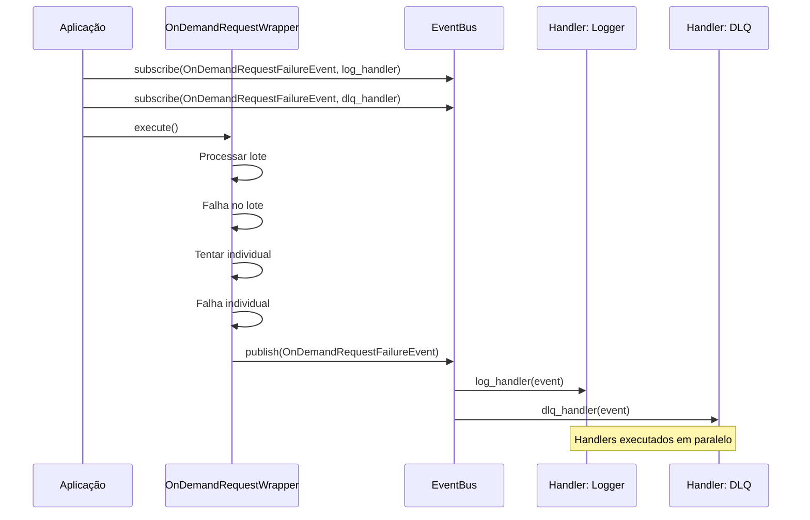

# Eventos

Sistema de eventos para comunicação desacoplada entre componentes do SDK.

## Módulo

```python
from sankhya_sdk.events import EventBus, OnDemandRequestFailureEvent
```

---

## EventBus

Barramento de eventos singleton para publicação e assinatura de eventos.

Permite desacoplamento entre componentes que geram eventos e handlers que os processam. Thread-safe usando locks para operações de registro/publicação.

### Características

| Característica | Descrição |
|----------------|-----------|
| **Singleton** | Instância única global |
| **Thread-safe** | Operações protegidas por lock |
| **Desacoplado** | Publishers e subscribers independentes |

### Métodos

#### `subscribe(event_type, handler)`

Registra um handler para um tipo de evento.

```python
from sankhya_sdk.events import EventBus, OnDemandRequestFailureEvent

def on_failure(event: OnDemandRequestFailureEvent) -> None:
    print(f"Falha em {event.entity}: {event.exception}")
    # Log, notificação, retry, etc.

EventBus.subscribe(OnDemandRequestFailureEvent, on_failure)
```

| Parâmetro | Tipo | Descrição |
|-----------|------|-----------|
| `event_type` | `Type[TEvent]` | Tipo do evento a ser assinado |
| `handler` | `Callable[[TEvent], None]` | Função que será chamada quando o evento for publicado |

---

#### `unsubscribe(event_type, handler) -> bool`

Remove um handler de um tipo de evento.

```python
success = EventBus.unsubscribe(OnDemandRequestFailureEvent, on_failure)
print(f"Handler removido: {success}")
```

| Parâmetro | Tipo | Descrição |
|-----------|------|-----------|
| `event_type` | `Type[TEvent]` | Tipo do evento |
| `handler` | `Callable[[TEvent], None]` | Handler a ser removido |

**Retorna:** `True` se o handler foi removido, `False` caso contrário.

---

#### `publish(event)`

Publica um evento para todos os handlers registrados.

```python
from sankhya_sdk.events import EventBus, OnDemandRequestFailureEvent

event = OnDemandRequestFailureEvent(
    entity=minha_entidade,
    is_update=True,
    exception=ValueError("Campo inválido"),
    error_message="Erro na validação",
    retry_count=3
)

EventBus.publish(event)
```

!!! note "Tratamento de Erros"
    Erros em handlers são capturados silenciosamente para não interromper outros handlers.

---

#### `clear(event_type=None)`

Remove todos os handlers de um tipo de evento ou todos os handlers.

```python
# Remove handlers de um tipo específico
EventBus.clear(OnDemandRequestFailureEvent)

# Remove todos os handlers
EventBus.clear()
```

---

#### `has_handlers(event_type) -> bool`

Verifica se há handlers registrados para um tipo de evento.

```python
if EventBus.has_handlers(OnDemandRequestFailureEvent):
    print("Há handlers registrados para falhas")
```

---

#### `handler_count(event_type) -> int`

Retorna o número de handlers registrados para um tipo de evento.

```python
count = EventBus.handler_count(OnDemandRequestFailureEvent)
print(f"Handlers registrados: {count}")
```

---

## OnDemandRequestFailureEvent

Evento disparado quando uma entidade falha no processamento on-demand.

### Quando é Disparado

Este evento é publicado quando:

1. Uma operação em lote (batch) falha
2. O fallback de processamento individual também falha
3. A entidade não pode ser processada após todas as tentativas

### Atributos

| Atributo | Tipo | Descrição |
|----------|------|-----------|
| `entity` | `Any` | A entidade que falhou ao ser processada |
| `is_update` | `bool` | `True` se a operação era atualização, `False` se era criação |
| `exception` | `BaseException` | A exceção que causou a falha |
| `error_message` | `Optional[str]` | Mensagem de erro opcional para contexto adicional |
| `retry_count` | `int` | Número de tentativas que foram feitas |

### Propriedades

#### `operation_type -> str`

Retorna o tipo de operação como string legível (`"update"` ou `"create"`).

### Exemplo de Uso

```python
from sankhya_sdk.events import EventBus, OnDemandRequestFailureEvent
from sankhya_sdk.request_wrappers import OnDemandRequestWrapper
import logging

logger = logging.getLogger(__name__)

# Handler para falhas
def handle_failure(event: OnDemandRequestFailureEvent) -> None:
    logger.error(
        f"Falha ao processar entidade: {event.entity}\n"
        f"Operação: {event.operation_type}\n"
        f"Tentativas: {event.retry_count}\n"
        f"Erro: {event.exception}"
    )
    
    # Opcional: salvar em fila para retry posterior
    # dead_letter_queue.add(event.entity)

# Registrar handler antes de iniciar operações
EventBus.subscribe(OnDemandRequestFailureEvent, handle_failure)

# Executar operações on-demand
# Se houver falhas, o handler será chamado automaticamente
wrapper = OnDemandRequestWrapper(...)
wrapper.execute()

# Limpar ao finalizar (opcional)
EventBus.unsubscribe(OnDemandRequestFailureEvent, handle_failure)
```

---

## Padrões de Uso

### Logging Centralizado

```python
import logging
from sankhya_sdk.events import EventBus, OnDemandRequestFailureEvent

def setup_failure_logging():
    logger = logging.getLogger("sankhya.failures")
    
    def log_failure(event: OnDemandRequestFailureEvent):
        logger.error(
            "Entity processing failed",
            extra={
                "entity_type": type(event.entity).__name__,
                "operation": event.operation_type,
                "retries": event.retry_count,
                "error": str(event.exception),
            }
        )
    
    EventBus.subscribe(OnDemandRequestFailureEvent, log_failure)
```

### Dead Letter Queue

```python
from collections import deque
from sankhya_sdk.events import EventBus, OnDemandRequestFailureEvent

# Fila para entidades que falharam
dead_letter_queue = deque()

def enqueue_failed(event: OnDemandRequestFailureEvent):
    dead_letter_queue.append({
        "entity": event.entity,
        "operation": event.operation_type,
        "error": str(event.exception),
        "retries": event.retry_count,
    })

EventBus.subscribe(OnDemandRequestFailureEvent, enqueue_failed)

# Depois, processar a fila manualmente
def process_dead_letter_queue():
    while dead_letter_queue:
        item = dead_letter_queue.popleft()
        # Tentar reprocessar ou notificar admin
```

### Notificação por Email/Slack

```python
from sankhya_sdk.events import EventBus, OnDemandRequestFailureEvent

def notify_team(event: OnDemandRequestFailureEvent):
    if event.retry_count >= 3:  # Só notifica após 3 tentativas
        # Enviar notificação
        send_slack_message(
            channel="#integrations",
            text=f"Falha crítica: {event.entity} - {event.exception}"
        )

EventBus.subscribe(OnDemandRequestFailureEvent, notify_team)
```

---

## Diagrama de Fluxo



---

## Ver Também

- [Request Wrappers](request-wrappers.md) - OnDemandRequestWrapper
- [Tratamento de Erros](../core-concepts/error-handling.md) - Estratégias de recuperação
