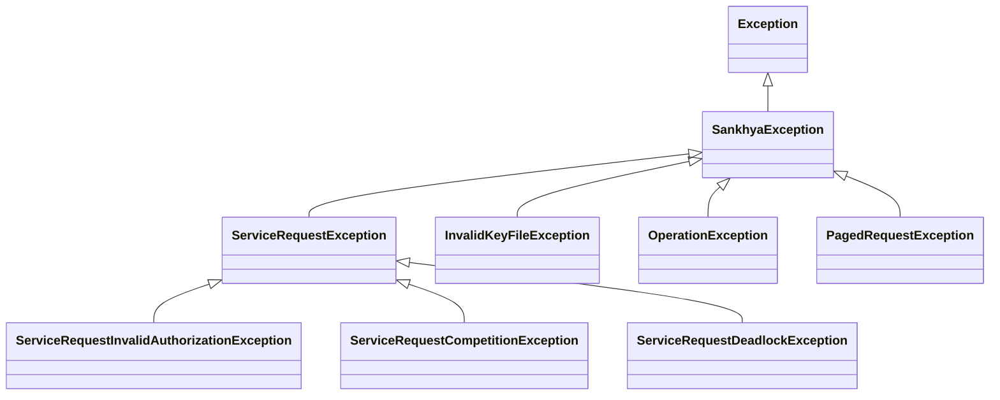

# Exceções

Documentação completa das exceções do SDK.

## Hierarquia



## Importação

```python
from sankhya_sdk.exceptions import (
    SankhyaException,
    ServiceRequestException,
    ServiceRequestInvalidAuthorizationException,
    ServiceRequestCompetitionException,
    ServiceRequestDeadlockException,
    InvalidKeyFileException,
    OperationException,
    PagedRequestException,
)
```

---

## SankhyaException

Classe base para todas as exceções do SDK.

### Atributos

| Atributo | Tipo | Descrição |
|----------|------|-----------|
| `message` | `str` | Mensagem de erro |
| `inner_exception` | `Exception \| None` | Exceção interna/causa |

### Uso

```python
from sankhya_sdk.exceptions import SankhyaException

try:
    # operação
except SankhyaException as e:
    print(f"Erro: {e.message}")
    if e.inner_exception:
        print(f"Causa: {e.inner_exception}")
```

---

## ServiceRequestException

Erro durante comunicação com a API.

### Atributos

| Atributo | Tipo | Descrição |
|----------|------|-----------|
| `message` | `str` | Mensagem de erro |
| `status_message` | `str` | Mensagem de status da API |
| `status_code` | `int` | Código de status |
| `service_name` | `str` | Nome do serviço chamado |

### Uso

```python
from sankhya_sdk.exceptions import ServiceRequestException

try:
    result = wrapper.find(Partner, "CODPARC > 0")
except ServiceRequestException as e:
    print(f"Serviço: {e.service_name}")
    print(f"Status: {e.status_code}")
    print(f"Mensagem: {e.status_message}")
```

---

## ServiceRequestInvalidAuthorizationException

Credenciais inválidas ou sessão não autorizada.

### Atributos

| Atributo | Tipo | Descrição |
|----------|------|-----------|
| `message` | `str` | Mensagem de erro |
| `username` | `str` | Nome de usuário utilizado |

### Uso

```python
from sankhya_sdk.exceptions import ServiceRequestInvalidAuthorizationException

try:
    ctx = SankhyaContext.from_settings()
except ServiceRequestInvalidAuthorizationException as e:
    print(f"Usuário inválido: {e.username}")
    # Não adianta retry - credenciais erradas
```

### Quando Ocorre

- Usuário ou senha incorretos
- Usuário sem permissão para API
- Token de sessão expirado e não renovável

---

## ServiceRequestCompetitionException

Erro de concorrência/lock no recurso.

### Atributos

| Atributo | Tipo | Descrição |
|----------|------|-----------|
| `message` | `str` | Mensagem de erro |
| `retry_after` | `int` | Segundos para aguardar antes de retry |

### Uso

```python
from sankhya_sdk.exceptions import ServiceRequestCompetitionException
import time

try:
    crud.update(entity)
except ServiceRequestCompetitionException as e:
    print(f"Recurso bloqueado, retry em: {e.retry_after}s")
    time.sleep(e.retry_after)
    crud.update(entity)  # Tentar novamente
```

### Quando Ocorre

- Outro processo está editando o mesmo registro
- Lock de tabela ativo
- Transação bloqueante em andamento

---

## ServiceRequestDeadlockException

Deadlock detectado no banco de dados.

### Atributos

| Atributo | Tipo | Descrição |
|----------|------|-----------|
| `message` | `str` | Mensagem de erro |
| `transaction_id` | `str` | ID da transação envolvida |

### Uso

```python
from sankhya_sdk.exceptions import ServiceRequestDeadlockException

try:
    crud.update(entity)
except ServiceRequestDeadlockException as e:
    print(f"Deadlock na transação: {e.transaction_id}")
    # SDK normalmente faz retry automático
```

### Quando Ocorre

- Duas ou mais transações aguardando recursos uma da outra
- Atualização massiva conflitante

---

## InvalidKeyFileException

Erro ao processar arquivo .key de credenciais.

### Atributos

| Atributo | Tipo | Descrição |
|----------|------|-----------|
| `message` | `str` | Mensagem de erro |
| `file_path` | `str` | Caminho do arquivo |

### Uso

```python
from sankhya_sdk.exceptions import InvalidKeyFileException

try:
    settings = SankhyaSettings.from_key_file("credenciais.key", "senha")
except InvalidKeyFileException as e:
    print(f"Erro no arquivo: {e.file_path}")
    print(f"Motivo: {e.message}")
```

### Quando Ocorre

- Arquivo não encontrado
- Formato inválido
- Senha incorreta para descriptografia
- Arquivo corrompido

---

## OperationException

Erro durante operação em entidade.

### Atributos

| Atributo | Tipo | Descrição |
|----------|------|-----------|
| `message` | `str` | Mensagem de erro |
| `operation` | `str` | Tipo de operação (find, update, etc.) |
| `entity_type` | `type` | Tipo da entidade envolvida |

### Uso

```python
from sankhya_sdk.exceptions import OperationException

try:
    crud.insert(partner)
except OperationException as e:
    print(f"Operação: {e.operation}")
    print(f"Entidade: {e.entity_type.__name__}")
    print(f"Erro: {e.message}")
```

### Quando Ocorre

- Validação de entidade falhou
- Operação não permitida
- Regra de negócio violada

---

## PagedRequestException

Erro durante operação paginada.

### Atributos

| Atributo | Tipo | Descrição |
|----------|------|-----------|
| `message` | `str` | Mensagem de erro |
| `page_number` | `int` | Número da página com erro |
| `total_pages` | `int` | Total de páginas esperado |

### Uso

```python
from sankhya_sdk.exceptions import PagedRequestException

try:
    for partner in paged.get_paged_results(Partner):
        process(partner)
except PagedRequestException as e:
    print(f"Erro na página {e.page_number}/{e.total_pages}")
    print(f"Motivo: {e.message}")
```

### Quando Ocorre

- Timeout ao carregar página
- Erro de comunicação durante paginação
- Sessão expirada durante iteração

---

## Padrão de Tratamento Recomendado

```python
from sankhya_sdk.exceptions import (
    SankhyaException,
    ServiceRequestException,
    ServiceRequestInvalidAuthorizationException,
    ServiceRequestCompetitionException,
    ServiceRequestDeadlockException,
    OperationException,
    PagedRequestException,
)

try:
    # Sua operação
    result = crud.find(Partner, "CODPARC > 0")
    
except ServiceRequestInvalidAuthorizationException:
    # Credenciais incorretas - não adianta retry
    logging.error("Credenciais inválidas")
    raise
    
except ServiceRequestCompetitionException as e:
    # Concorrência - pode tentar novamente
    logging.warning(f"Recurso bloqueado, aguardando {e.retry_after}s")
    time.sleep(e.retry_after)
    result = crud.find(Partner, "CODPARC > 0")
    
except ServiceRequestDeadlockException:
    # Deadlock - SDK deve fazer retry automático
    # Se chegou aqui, esgotou tentativas
    logging.error("Deadlock persistente")
    raise
    
except ServiceRequestException as e:
    # Outros erros de comunicação
    logging.error(f"Erro API: {e.status_message}")
    raise
    
except OperationException as e:
    # Erro de operação (validação, regra de negócio)
    logging.error(f"Erro de operação: {e.message}")
    raise
    
except SankhyaException as e:
    # Qualquer outro erro do SDK
    logging.error(f"Erro SDK: {e.message}")
    raise
    
except Exception as e:
    # Erros inesperados
    logging.exception(f"Erro inesperado: {e}")
    raise
```

## Próximos Passos

- [Tratamento de Erros](../core-concepts/error-handling.md) - Estratégias avançadas
- [Request Helpers](helpers.md) - Configuração de retry
- [Core](core.md) - Classes principais
