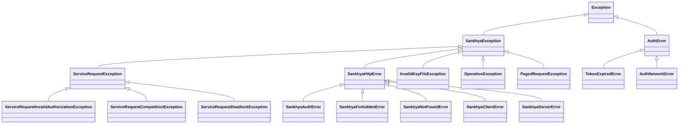

# Exceções

Documentação completa das exceções do SDK.

## Hierarquia



## Importação

```python
from sankhya_sdk.exceptions import (
    # Base
    SankhyaException,
    
    # Legado (XML)
    ServiceRequestException,
    ServiceRequestInvalidAuthorizationException,
    ServiceRequestCompetitionException,
    ServiceRequestDeadlockException,
    InvalidKeyFileException,
    OperationException,
    PagedRequestException,
    
    # HTTP (Gateway JSON)
    SankhyaHttpError,
    SankhyaAuthError,
    SankhyaForbiddenError,
    SankhyaNotFoundError,
    SankhyaClientError,
    SankhyaServerError,
    raise_for_status,
)

# Exceções de Autenticação OAuth2
from sankhya_sdk.auth import (
    AuthError,
    TokenExpiredError,
    AuthNetworkError,
)
```

---

## SankhyaException

Classe base para todas as exceções do SDK.

### Atributos

| Atributo | Tipo | Descrição |
|----------|------|-----------|
| `message` | `str` | Mensagem de erro |
| `inner_exception` | `Exception \| None` | Exceção interna/causa |

### Uso

```python
from sankhya_sdk.exceptions import SankhyaException

try:
    # operação
except SankhyaException as e:
    print(f"Erro: {e.message}")
    if e.inner_exception:
        print(f"Causa: {e.inner_exception}")
```

---

## ServiceRequestException

Erro durante comunicação com a API.

### Atributos

| Atributo | Tipo | Descrição |
|----------|------|-----------|
| `message` | `str` | Mensagem de erro |
| `status_message` | `str` | Mensagem de status da API |
| `status_code` | `int` | Código de status |
| `service_name` | `str` | Nome do serviço chamado |

### Uso

```python
from sankhya_sdk.exceptions import ServiceRequestException

try:
    result = wrapper.find(Partner, "CODPARC > 0")
except ServiceRequestException as e:
    print(f"Serviço: {e.service_name}")
    print(f"Status: {e.status_code}")
    print(f"Mensagem: {e.status_message}")
```

---

## ServiceRequestInvalidAuthorizationException

Credenciais inválidas ou sessão não autorizada.

### Atributos

| Atributo | Tipo | Descrição |
|----------|------|-----------|
| `message` | `str` | Mensagem de erro |
| `username` | `str` | Nome de usuário utilizado |

### Uso

```python
from sankhya_sdk.exceptions import ServiceRequestInvalidAuthorizationException

try:
    ctx = SankhyaContext.from_settings()
except ServiceRequestInvalidAuthorizationException as e:
    print(f"Usuário inválido: {e.username}")
    # Não adianta retry - credenciais erradas
```

### Quando Ocorre

- Usuário ou senha incorretos
- Usuário sem permissão para API
- Token de sessão expirado e não renovável

---

## ServiceRequestCompetitionException

Erro de concorrência/lock no recurso.

### Atributos

| Atributo | Tipo | Descrição |
|----------|------|-----------|
| `message` | `str` | Mensagem de erro |
| `retry_after` | `int` | Segundos para aguardar antes de retry |

### Uso

```python
from sankhya_sdk.exceptions import ServiceRequestCompetitionException
import time

try:
    crud.update(entity)
except ServiceRequestCompetitionException as e:
    print(f"Recurso bloqueado, retry em: {e.retry_after}s")
    time.sleep(e.retry_after)
    crud.update(entity)  # Tentar novamente
```

### Quando Ocorre

- Outro processo está editando o mesmo registro
- Lock de tabela ativo
- Transação bloqueante em andamento

---

## ServiceRequestDeadlockException

Deadlock detectado no banco de dados.

### Atributos

| Atributo | Tipo | Descrição |
|----------|------|-----------|
| `message` | `str` | Mensagem de erro |
| `transaction_id` | `str` | ID da transação envolvida |

### Uso

```python
from sankhya_sdk.exceptions import ServiceRequestDeadlockException

try:
    crud.update(entity)
except ServiceRequestDeadlockException as e:
    print(f"Deadlock na transação: {e.transaction_id}")
    # SDK normalmente faz retry automático
```

### Quando Ocorre

- Duas ou mais transações aguardando recursos uma da outra
- Atualização massiva conflitante

---

## InvalidKeyFileException

Erro ao processar arquivo .key de credenciais.

### Atributos

| Atributo | Tipo | Descrição |
|----------|------|-----------|
| `message` | `str` | Mensagem de erro |
| `file_path` | `str` | Caminho do arquivo |

### Uso

```python
from sankhya_sdk.exceptions import InvalidKeyFileException

try:
    settings = SankhyaSettings.from_key_file("credenciais.key", "senha")
except InvalidKeyFileException as e:
    print(f"Erro no arquivo: {e.file_path}")
    print(f"Motivo: {e.message}")
```

### Quando Ocorre

- Arquivo não encontrado
- Formato inválido
- Senha incorreta para descriptografia
- Arquivo corrompido

---

## OperationException

Erro durante operação em entidade.

### Atributos

| Atributo | Tipo | Descrição |
|----------|------|-----------|
| `message` | `str` | Mensagem de erro |
| `operation` | `str` | Tipo de operação (find, update, etc.) |
| `entity_type` | `type` | Tipo da entidade envolvida |

### Uso

```python
from sankhya_sdk.exceptions import OperationException

try:
    crud.insert(partner)
except OperationException as e:
    print(f"Operação: {e.operation}")
    print(f"Entidade: {e.entity_type.__name__}")
    print(f"Erro: {e.message}")
```

### Quando Ocorre

- Validação de entidade falhou
- Operação não permitida
- Regra de negócio violada

---

## PagedRequestException

Erro durante operação paginada.

### Atributos

| Atributo | Tipo | Descrição |
|----------|------|-----------|
| `message` | `str` | Mensagem de erro |
| `page_number` | `int` | Número da página com erro |
| `total_pages` | `int` | Total de páginas esperado |

### Uso

```python
from sankhya_sdk.exceptions import PagedRequestException

try:
    for partner in paged.get_paged_results(Partner):
        process(partner)
except PagedRequestException as e:
    print(f"Erro na página {e.page_number}/{e.total_pages}")
    print(f"Motivo: {e.message}")
```

### Quando Ocorre

- Timeout ao carregar página
- Erro de comunicação durante paginação
- Sessão expirada durante iteração

---

## Padrão de Tratamento Recomendado

```python
from sankhya_sdk.exceptions import (
    SankhyaException,
    ServiceRequestException,
    ServiceRequestInvalidAuthorizationException,
    ServiceRequestCompetitionException,
    ServiceRequestDeadlockException,
    OperationException,
    PagedRequestException,
)

try:
    # Sua operação
    result = crud.find(Partner, "CODPARC > 0")
    
except ServiceRequestInvalidAuthorizationException:
    # Credenciais incorretas - não adianta retry
    logging.error("Credenciais inválidas")
    raise
    
except ServiceRequestCompetitionException as e:
    # Concorrência - pode tentar novamente
    logging.warning(f"Recurso bloqueado, aguardando {e.retry_after}s")
    time.sleep(e.retry_after)
    result = crud.find(Partner, "CODPARC > 0")
    
except ServiceRequestDeadlockException:
    # Deadlock - SDK deve fazer retry automático
    # Se chegou aqui, esgotou tentativas
    logging.error("Deadlock persistente")
    raise
    
except ServiceRequestException as e:
    # Outros erros de comunicação
    logging.error(f"Erro API: {e.status_message}")
    raise
    
except OperationException as e:
    # Erro de operação (validação, regra de negócio)
    logging.error(f"Erro de operação: {e.message}")
    raise
    
except SankhyaException as e:
    # Qualquer outro erro do SDK
    logging.error(f"Erro SDK: {e.message}")
    raise
    
except Exception as e:
    # Erros inesperados
    logging.exception(f"Erro inesperado: {e}")
    raise
```

## Próximos Passos

- [Tratamento de Erros](../core-concepts/error-handling.md) - Estratégias avançadas
- [Request Helpers](helpers.md) - Configuração de retry
- [Core](core.md) - Classes principais
- [Autenticação](auth.md) - Detalhes sobre exceções de auth

---

## Exceções de Autenticação OAuth2

Exceções específicas para o módulo de autenticação OAuth2.

### AuthError

Exceção base para erros de autenticação.

```python
from sankhya_sdk.auth import AuthError

try:
    oauth.authenticate(client_id, client_secret)
except AuthError as e:
    print(f"Erro: {e.message}")
    print(f"Código: {e.code}")
    print(f"Status HTTP: {e.status_code}")
```

#### Atributos

| Atributo | Tipo | Descrição |
|----------|------|-----------|
| `message` | `str` | Mensagem de erro |
| `code` | `Optional[str]` | Código de erro da API |
| `status_code` | `Optional[int]` | Status HTTP da resposta |

---

### TokenExpiredError

Exceção para tokens expirados.

```python
from sankhya_sdk.auth import TokenExpiredError

try:
    token = token_manager.get_token()
except TokenExpiredError:
    print("Token expirado, renovando...")
    new_token = oauth.refresh_token()
```

**Quando ocorre:**

- Token de acesso expirou
- Nenhum token disponível
- Token próximo de expirar (dentro do buffer de 60s)

---

### AuthNetworkError

Exceção para erros de rede durante autenticação.

```python
from sankhya_sdk.auth import AuthNetworkError
import time

def authenticate_with_retry(oauth, max_retries=3):
    for attempt in range(max_retries):
        try:
            return oauth.authenticate(client_id, client_secret)
        except AuthNetworkError as e:
            if attempt < max_retries - 1:
                time.sleep(2 ** attempt)  # Backoff exponencial
            else:
                raise
```

**Quando ocorre:**

- Timeout de conexão
- DNS não resolvido
- Servidor inacessível
- Conexão recusada

---

## Exceções HTTP (Gateway JSON)

Exceções específicas para a API Gateway JSON, mapeadas para códigos HTTP.

### SankhyaHttpError

Classe base para erros HTTP do Gateway.

#### Atributos

| Atributo | Tipo | Descrição |
|----------|------|-----------|
| `message` | `str` | Mensagem de erro |
| `status_code` | `int` | Código HTTP |
| `response_body` | `str` | Corpo da resposta |

#### Uso

```python
from sankhya_sdk.exceptions import SankhyaHttpError

try:
    result = client.load_records("Parceiro", ["CODPARC"])
except SankhyaHttpError as e:
    print(f"HTTP {e.status_code}: {e.message}")
    print(f"Resposta: {e.response_body}")
```

---

### SankhyaAuthError

Erro de autenticação (HTTP 401).

```python
from sankhya_sdk.exceptions import SankhyaAuthError

try:
    result = client.load_records("Parceiro", ["CODPARC"])
except SankhyaAuthError:
    print("Token expirado ou inválido. Reautentique.")
    oauth.authenticate(client_id="...", client_secret="...")
```

**Quando ocorre**:

- Token expirado
- Token inválido ou malformado
- Credenciais ausentes

---

### SankhyaForbiddenError

Erro de autorização (HTTP 403).

```python
from sankhya_sdk.exceptions import SankhyaForbiddenError

try:
    result = client.load_records("DadosSensiveis", ["CAMPO"])
except SankhyaForbiddenError:
    print("Usuário sem permissão para acessar este recurso.")
```

**Quando ocorre**:

- Usuário autenticado mas sem permissão
- Acesso a entidade restrita
- Operação não autorizada

---

### SankhyaNotFoundError

Recurso não encontrado (HTTP 404).

```python
from sankhya_sdk.exceptions import SankhyaNotFoundError

try:
    result = client.execute_service("ServicoInexistente.metodo", {})
except SankhyaNotFoundError:
    print("Serviço ou entidade não encontrado.")
```

**Quando ocorre**:

- Entidade não existe
- Serviço não registrado
- Endpoint incorreto

---

### SankhyaClientError

Erro genérico do cliente (HTTP 4xx).

```python
from sankhya_sdk.exceptions import SankhyaClientError

try:
    result = client.save_record("Parceiro", {"CAMPO_INVALIDO": "valor"})
except SankhyaClientError as e:
    print(f"Erro {e.status_code}: {e.message}")
```

**Quando ocorre**:

- Payload inválido
- Validação falhou
- Parâmetros incorretos

---

### SankhyaServerError

Erro do servidor (HTTP 5xx).

```python
from sankhya_sdk.exceptions import SankhyaServerError
import time

try:
    result = client.load_records("Parceiro", ["CODPARC"])
except SankhyaServerError as e:
    print(f"Erro no servidor: {e.status_code}")
    # Considerar retry com backoff
    time.sleep(5)
```

**Quando ocorre**:

- Erro interno no servidor Sankhya
- Timeout no processamento
- Serviço temporariamente indisponível

---

### raise_for_status

Função auxiliar para levantar exceção baseada no status HTTP.

```python
from sankhya_sdk.exceptions import raise_for_status

# Uso manual (normalmente não necessário)
response = requests.get(url)
raise_for_status(response.status_code, response.text)
```

---

## Padrão de Tratamento para Gateway

```python
from sankhya_sdk.http import GatewayClient
from sankhya_sdk.exceptions import (
    SankhyaAuthError,
    SankhyaForbiddenError,
    SankhyaNotFoundError,
    SankhyaClientError,
    SankhyaServerError,
)

def execute_safely(client: GatewayClient, entity: str, fields: list):
    try:
        return client.load_records(entity, fields)
        
    except SankhyaAuthError:
        # Token expirado - reautenticar
        logging.warning("Token expirado, reautenticando...")
        # oauth.authenticate(...)
        raise
        
    except SankhyaForbiddenError:
        # Sem permissão - não adianta retry
        logging.error(f"Sem permissão para {entity}")
        raise
        
    except SankhyaNotFoundError:
        # Entidade não existe
        logging.warning(f"Entidade {entity} não encontrada")
        return None
        
    except SankhyaClientError as e:
        # Erro de requisição
        logging.error(f"Erro cliente {e.status_code}: {e.response_body}")
        raise
        
    except SankhyaServerError as e:
        # Erro servidor - pode tentar retry
        logging.error(f"Erro servidor {e.status_code}")
        raise
```
