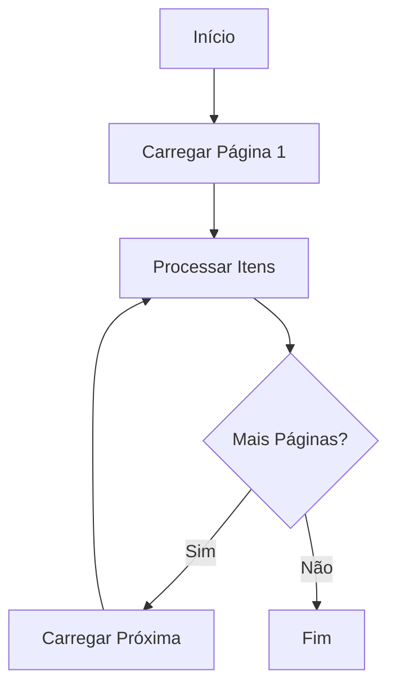
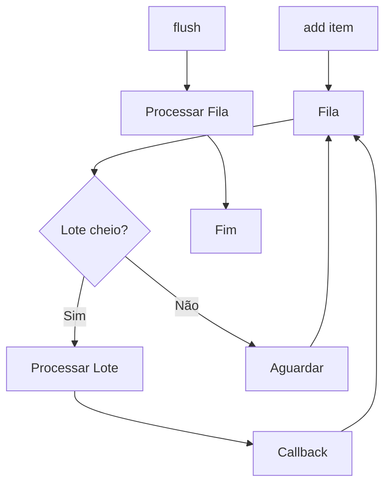

# Request Wrappers

Documentação dos wrappers de alto nível para operações com a API.

## Visão Geral

Os Request Wrappers abstraem operações complexas em interfaces simples:

| Wrapper | Uso |
|---------|-----|
| `SimpleCRUDRequestWrapper` | Operações CRUD básicas |
| `PagedRequestWrapper` | Consultas paginadas |
| `OnDemandRequestWrapper` | Processamento em lote |
| `KnowServicesRequestWrapper` | Serviços específicos |

```python
from sankhya_sdk.request_wrappers import (
    SimpleCRUDRequestWrapper,
    PagedRequestWrapper,
    OnDemandRequestWrapper,
    KnowServicesRequestWrapper,
)
```

---

## SimpleCRUDRequestWrapper

Wrapper para operações CRUD básicas.

### Uso Básico

```python
from sankhya_sdk import SankhyaContext
from sankhya_sdk.request_wrappers import SimpleCRUDRequestWrapper
from sankhya_sdk.transport_entities import Partner

with SankhyaContext.from_settings() as ctx:
    crud = SimpleCRUDRequestWrapper(ctx.wrapper)
    
    # Find
    partners = crud.find(Partner, "CODPARC > 0", max_results=10)
    
    # Update
    partner = partners[0]
    partner.email = "novo@email.com"
    crud.update(partner)
    
    # Insert
    new_partner = Partner()
    new_partner.name = "Novo Cliente"
    crud.insert(new_partner)
    
    # Remove
    crud.remove(partner)
```

### Métodos

#### `find(entity_type, criteria, max_results) -> list[T]`

Busca entidades.

```python
partners = crud.find(Partner, "ATIVO = 'S'", max_results=100)
```

| Parâmetro | Tipo | Padrão | Descrição |
|-----------|------|--------|-----------|
| `entity_type` | `Type[T]` | - | Tipo da entidade |
| `criteria` | `str` | `""` | Critério de busca |
| `max_results` | `int` | `0` | Limite (0 = sem limite) |

#### `find_with_options(entity_type, criteria, options) -> list[T]`

Busca com opções avançadas.

```python
from sankhya_sdk.helpers import EntityQueryOptions

options = EntityQueryOptions(
    include_fields=["CODPARC", "NOMEPARC"],
    order_by="NOMEPARC",
    include_references=True
)
partners = crud.find_with_options(Partner, "ATIVO = 'S'", options)
```

#### `update(entity) -> EntityBase`

Atualiza uma entidade.

```python
partner.email = "novo@email.com"
updated = crud.update(partner)
```

#### `insert(entity) -> EntityBase`

Insere nova entidade.

```python
created = crud.insert(partner)
print(created.code_partner)  # Código gerado
```

#### `remove(entity) -> bool`

Remove uma entidade.

```python
success = crud.remove(partner)
```

---

## PagedRequestWrapper

Wrapper para consultas paginadas com grandes volumes de dados.

### Uso Básico

```python
from sankhya_sdk.request_wrappers import PagedRequestWrapper

with SankhyaContext.from_settings() as ctx:
    paged = PagedRequestWrapper(ctx.wrapper)
    
    # Itera sobre resultados paginados
    for partner in paged.get_paged_results(Partner, "ATIVO = 'S'"):
        print(partner.name)
```

### Fluxo de Paginação



### Construtor

```python
paged = PagedRequestWrapper(
    wrapper=ctx.wrapper,
    page_size=100,          # Itens por página
    max_results=1000,       # Limite total
    timeout=300,            # Timeout em segundos
    enable_cache=False      # Cache em memória
)
```

| Parâmetro | Tipo | Padrão | Descrição |
|-----------|------|--------|-----------|
| `wrapper` | `SankhyaWrapper` | - | Wrapper para requisições |
| `page_size` | `int` | `100` | Itens por página |
| `max_results` | `int` | `0` | Limite total (0 = sem limite) |
| `timeout` | `int` | `300` | Timeout em segundos |
| `enable_cache` | `bool` | `False` | Habilita cache |

### Métodos

#### `get_paged_results(entity_type, criteria) -> Generator[T]`

Retorna generator para iteração paginada.

```python
for partner in paged.get_paged_results(Partner, "CODPARC > 0"):
    process(partner)
```

#### `get_paged_results_async(entity_type, criteria) -> AsyncGenerator[T]`

Versão assíncrona.

```python
async for partner in paged.get_paged_results_async(Partner):
    await process(partner)
```

### Callbacks

```python
from sankhya_sdk.value_objects import PagedRequestEventArgs

def on_page_loaded(args: PagedRequestEventArgs):
    print(f"Página {args.current_page}/{args.total_pages}")
    print(f"Itens: {args.items_in_page}")

def on_error(args: PagedRequestEventArgs):
    print(f"Erro na página {args.current_page}: {args.error}")

paged.on_page_loaded = on_page_loaded
paged.on_error = on_error
```

---

## OnDemandRequestWrapper

Wrapper para processamento em lote com fila.

### Uso Básico

```python
from sankhya_sdk.request_wrappers import OnDemandRequestWrapper

with SankhyaContext.from_settings() as ctx:
    on_demand = OnDemandRequestWrapper(
        wrapper=ctx.wrapper,
        throughput=10,  # Itens por lote
        operation=OperationType.UPDATE
    )
    
    # Adiciona itens à fila
    for partner in partners:
        on_demand.add(partner)
    
    # Processa fila
    on_demand.flush()
```

### Fluxo de Processamento



### Construtor

```python
on_demand = OnDemandRequestWrapper(
    wrapper=ctx.wrapper,
    throughput=10,                    # Itens por lote
    allow_above_throughput=True,      # Permitir lotes maiores
    operation=OperationType.UPDATE,   # Tipo de operação
)
```

### Métodos

#### `add(entity: EntityBase) -> None`

Adiciona entidade à fila.

```python
on_demand.add(partner)
```

#### `flush() -> None`

Processa todos os itens da fila.

```python
on_demand.flush()
```

#### `cancel() -> None`

Cancela processamento.

```python
on_demand.cancel()
```

### Callbacks

```python
def on_batch_processed(entities: list[EntityBase], success: bool):
    print(f"Lote processado: {len(entities)} itens, sucesso: {success}")

def on_failure(entity: EntityBase, error: Exception):
    print(f"Falha em {entity}: {error}")

on_demand.on_batch_processed = on_batch_processed
on_demand.on_failure = on_failure
```

---

## KnowServicesRequestWrapper

Wrapper para serviços específicos (NF-e, faturamento, etc.).

### Uso Básico

```python
from sankhya_sdk.request_wrappers import KnowServicesRequestWrapper

with SankhyaContext.from_settings() as ctx:
    services = KnowServicesRequestWrapper(ctx.wrapper)
    
    # Faturar nota
    services.bill(single_number=12345, billing_type=BillingType.INVOICE)
    
    # Confirmar nota
    services.confirm_invoice(single_number=12345)
```

### Métodos de Sessão

#### `keep_alive() -> None`

Mantém sessão ativa.

```python
services.keep_alive()
```

#### `send_message(message, title, recipient_users) -> None`

Envia mensagem interna.

```python
services.send_message(
    message="Texto da mensagem",
    title="Título",
    recipient_users=[1, 2, 3]
)
```

### Métodos de Nota Fiscal

#### `bill(single_number, billing_type) -> ServiceResponse`

Fatura uma nota.

```python
services.bill(
    single_number=12345,
    billing_type=BillingType.INVOICE
)
```

#### `confirm_invoice(single_number) -> ServiceResponse`

Confirma uma nota.

```python
services.confirm_invoice(single_number=12345)
```

#### `cancel_invoice(single_number, justification) -> ServiceResponse`

Cancela uma nota.

```python
services.cancel_invoice(
    single_number=12345,
    justification="Motivo do cancelamento"
)
```

#### `duplicate_invoice(single_number) -> ServiceResponse`

Duplica uma nota.

```python
new_note = services.duplicate_invoice(single_number=12345)
```

### Métodos de NF-e

#### `transmit_nfe(single_number) -> ServiceResponse`

Transmite NF-e para SEFAZ.

```python
services.transmit_nfe(single_number=12345)
```

#### `query_nfe_status(single_number) -> ServiceResponse`

Consulta status da NF-e.

```python
status = services.query_nfe_status(single_number=12345)
```

### Métodos de Arquivo/Imagem

#### `get_file(filename) -> bytes`

Baixa arquivo.

```python
content = services.get_file("relatorio.pdf")
```

#### `get_image(primary_key, entity_name) -> bytes`

Baixa imagem de entidade.

```python
image = services.get_image({"CODPROD": 100}, "Produto")
```

---

## Async Wrappers

Versões assíncronas dos wrappers principais.

### AsyncSimpleCRUDRequestWrapper

```python
from sankhya_sdk.request_wrappers import AsyncSimpleCRUDRequestWrapper

async with AsyncSankhyaContext.from_settings() as ctx:
    crud = AsyncSimpleCRUDRequestWrapper(ctx.wrapper)
    partners = await crud.find(Partner, "CODPARC > 0")
```

### AsyncOnDemandRequestWrapper

```python
from sankhya_sdk.request_wrappers import AsyncOnDemandRequestWrapper

async with AsyncSankhyaContext.from_settings() as ctx:
    on_demand = AsyncOnDemandRequestWrapper(ctx.wrapper)
    
    for partner in partners:
        await on_demand.add(partner)
    
    await on_demand.flush()
```

## Próximos Passos

- [Helpers](helpers.md) - Utilitários auxiliares
- [Core](core.md) - Classes principais
- [Exemplos](../examples/index.md) - Exemplos práticos
