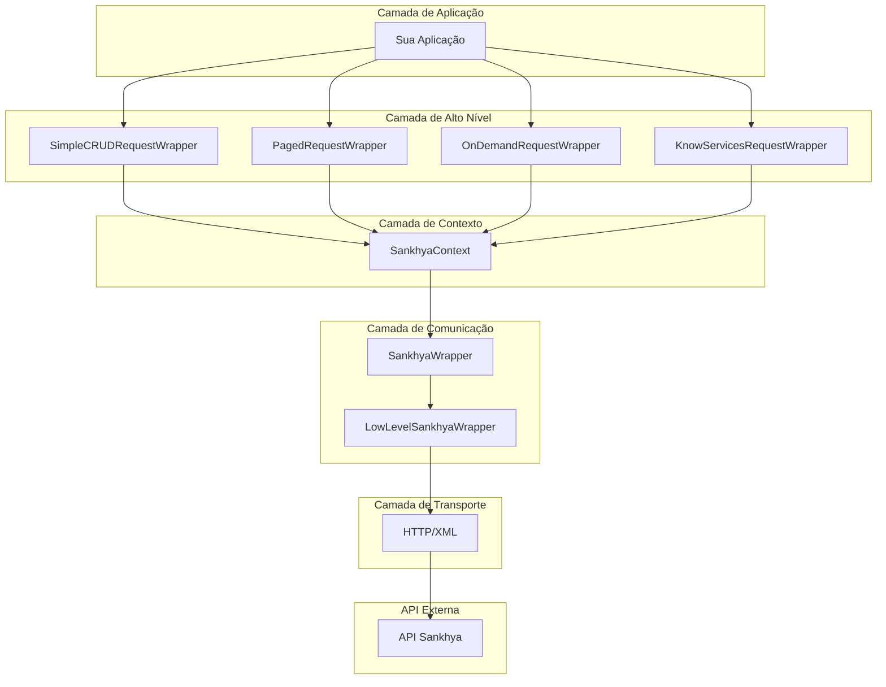
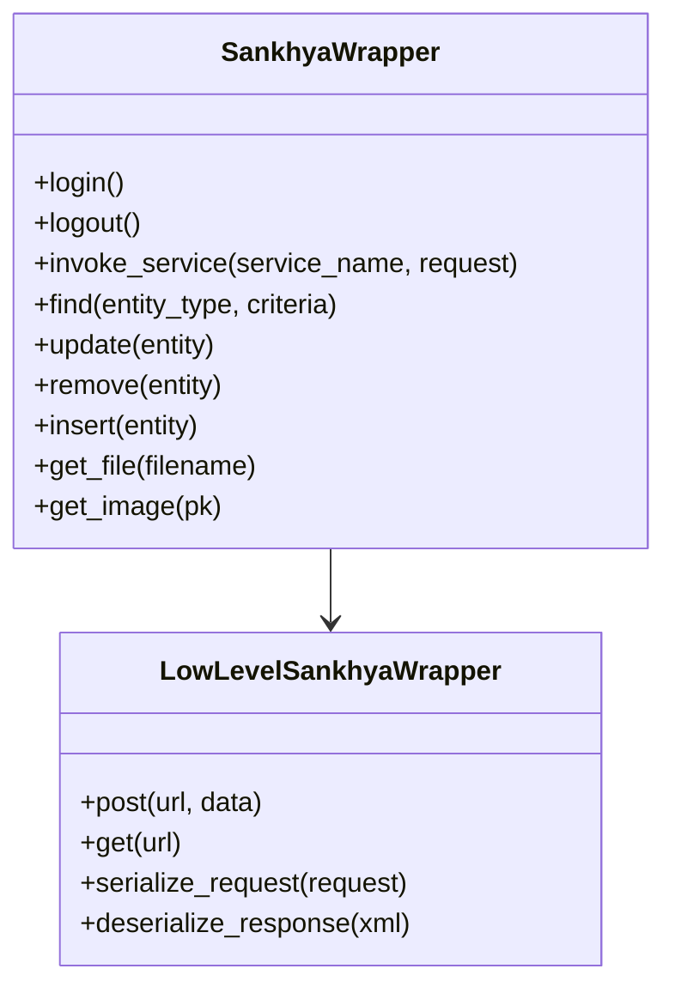
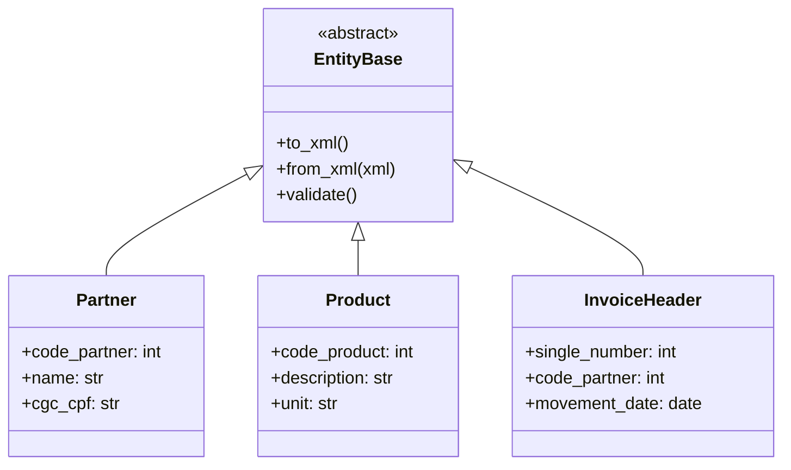
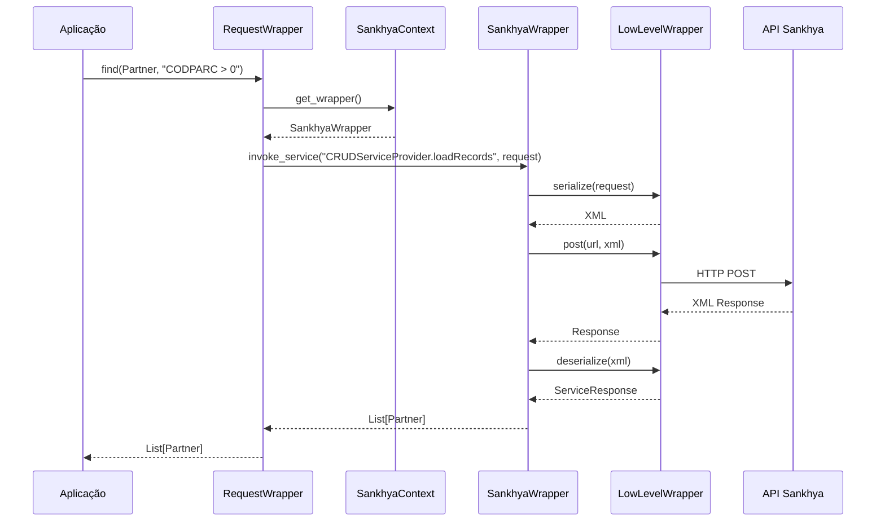
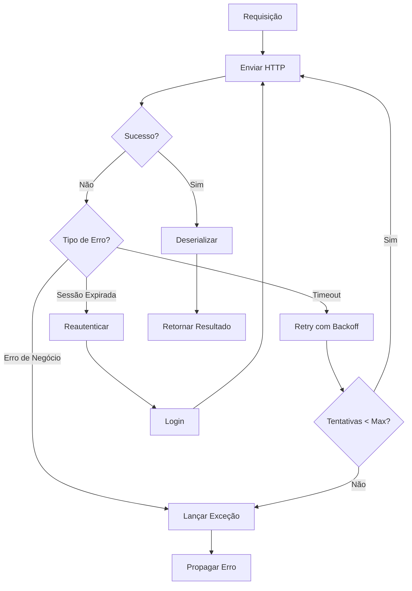

# Arquitetura

Este documento descreve a arquitetura do Sankhya SDK Python, seus componentes e como eles se integram.

## Visão Geral da Arquitetura

O SDK segue uma arquitetura em camadas, onde cada camada tem responsabilidades bem definidas:



## Componentes Principais

### 1. Request Wrappers (Camada de Alto Nível)

Abstrações de alto nível que simplificam operações comuns:

| Wrapper | Responsabilidade |
|---------|------------------|
| `SimpleCRUDRequestWrapper` | Operações CRUD básicas (Find, Insert, Update, Remove) |
| `PagedRequestWrapper` | Consultas paginadas para grandes volumes de dados |
| `OnDemandRequestWrapper` | Processamento em lote com callbacks |
| `KnowServicesRequestWrapper` | Serviços específicos (NF-e, faturamento, etc.) |

```python
from sankhya_sdk.request_wrappers import (
    SimpleCRUDRequestWrapper,
    PagedRequestWrapper,
    OnDemandRequestWrapper,
    KnowServicesRequestWrapper,
)
```

### 2. SankhyaContext (Camada de Contexto)

Gerenciador central de estado e ciclo de vida:

```python
from sankhya_sdk import SankhyaContext

with SankhyaContext.from_settings() as ctx:
    # ctx gerencia:
    # - Autenticação
    # - Sessões
    # - Wrappers registrados
    # - Lifecycle (login/logout)
    pass
```

**Responsabilidades:**

- Gerenciamento de sessões (única e múltiplas)
- Registro e descarte de wrappers
- Context manager para cleanup automático
- Invocação de serviços com tokens específicos

### 3. SankhyaWrapper (Camada de Comunicação)

Cliente de alto nível para comunicação com a API:



**Responsabilidades:**

- Serialização/deserialização XML
- Retry automático com backoff exponencial
- Tratamento de exceções
- Gerenciamento de cookies de sessão

### 4. Modelos e Entidades



## Fluxo de Dados

### Requisição



### Tratamento de Erros



## Padrões de Design

### 1. Context Manager

O SDK usa context managers para gerenciamento de recursos:

```python
# Padrão Python
with SankhyaContext.from_settings() as ctx:
    # Recursos garantidamente liberados
    pass
```

### 2. Factory Pattern

Criação de wrappers e objetos:

```python
# SankhyaContext como factory
ctx = SankhyaContext.from_settings()  # Factory method
token = ctx.acquire_session()          # Factory para sessões
```

### 3. Strategy Pattern

Diferentes estratégias de retry:

```python
from sankhya_sdk.request_helpers import RequestBehaviorOptions

options = RequestBehaviorOptions(
    max_retry_count=5,
    retry_delay_ms=1000,
    backoff_multiplier=2.0
)
```

### 4. Decorator Pattern

Sistema de decorators para entidades:

```python
from sankhya_sdk.attributes import entity, entity_key, entity_element

@entity("Parceiro")
class Partner:
    @entity_key("CODPARC")
    code_partner: int
    
    @entity_element("NOMEPARC")
    name: str
```

### 5. Observer Pattern

Callbacks em operações paginadas:

```python
def on_page_loaded(args):
    print(f"Página {args.current_page} carregada")

paged = PagedRequestWrapper(wrapper)
paged.on_page_loaded += on_page_loaded
```

## Estrutura de Diretórios

```
sankhya_sdk/
├── __init__.py              # Exports principais
├── core/
│   ├── context.py           # SankhyaContext
│   ├── wrapper.py           # SankhyaWrapper
│   ├── settings.py          # Configurações
│   ├── constants.py         # Constantes
│   └── types.py             # Tipos base
├── attributes/
│   └── decorators.py        # Decorators de entidades
├── enums/
│   └── __init__.py          # Enumerações
├── exceptions/
│   └── __init__.py          # Hierarquia de exceções
├── helpers/
│   ├── entity_extensions.py # Utilitários de entidades
│   ├── filter_expression.py # Construtor de filtros
│   └── status_message.py    # Mensagens de status
├── request_wrappers/
│   ├── simple_crud.py       # CRUD simples
│   ├── paged.py             # Paginação
│   ├── on_demand.py         # Processamento em lote
│   └── know_services.py     # Serviços específicos
├── service_models/
│   └── __init__.py          # ServiceRequest/Response
├── transport_entities/
│   ├── partner.py           # Parceiros
│   ├── product.py           # Produtos
│   └── invoice.py           # Notas fiscais
├── validations/
│   ├── entity_validator.py  # Validador de entidades
│   └── entity_validation.py # Regras de validação
└── value_objects/
    └── __init__.py          # Objetos de valor
```

## Extensibilidade

### Criando Entidades Customizadas

```python
from sankhya_sdk.attributes import entity, entity_key, entity_element
from sankhya_sdk.transport_entities import EntityBase

@entity("MeuCampo", "AD_MEUCAMPO")
class MinhaEntidade(EntityBase):
    @entity_key("IDCAMPO")
    id_campo: int
    
    @entity_element("DESCRICAO")
    descricao: str
    
    @entity_element("VALOR", required=False)
    valor: float = 0.0
```

### Criando Wrappers Customizados

```python
from sankhya_sdk.request_wrappers import SimpleCRUDRequestWrapper

class MeuWrapper(SimpleCRUDRequestWrapper):
    def minha_operacao(self, parametros):
        # Lógica customizada
        return self.wrapper.invoke_service(
            "MeuServicoCustomizado",
            self._build_request(parametros)
        )
```

## Considerações de Performance

### Conexões HTTP

- Pool de conexões gerenciado automaticamente
- Keep-alive habilitado por padrão
- Timeout configurável

### Serialização XML

- lxml para parsing eficiente
- Caching de schemas quando possível

### Grandes Volumes de Dados

- Use `PagedRequestWrapper` para consultas grandes
- Use `OnDemandRequestWrapper` para processamento em lote
- Configure `max_results` apropriadamente

## Próximos Passos

- [Gerenciamento de Sessões](session-management.md) - Detalhes sobre sessões
- [Sistema de Entidades](entity-system.md) - Criação de entidades
- [Tratamento de Erros](error-handling.md) - Estratégias de erro
