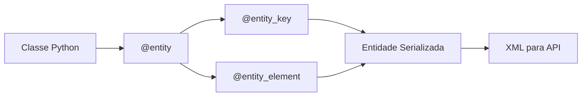
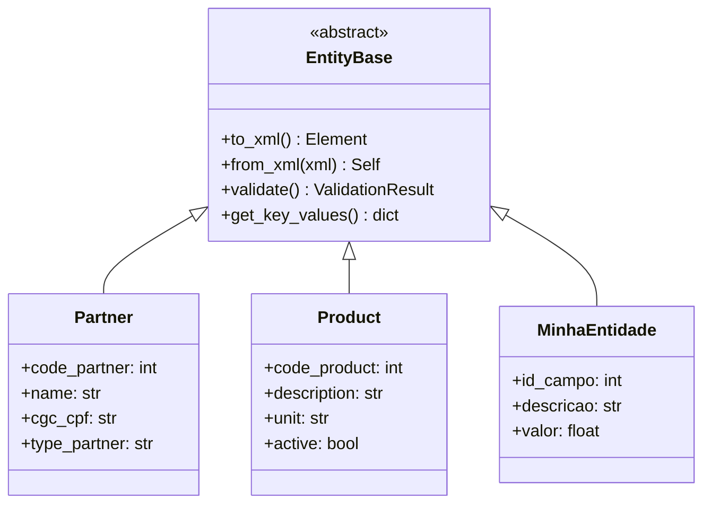
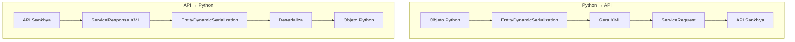
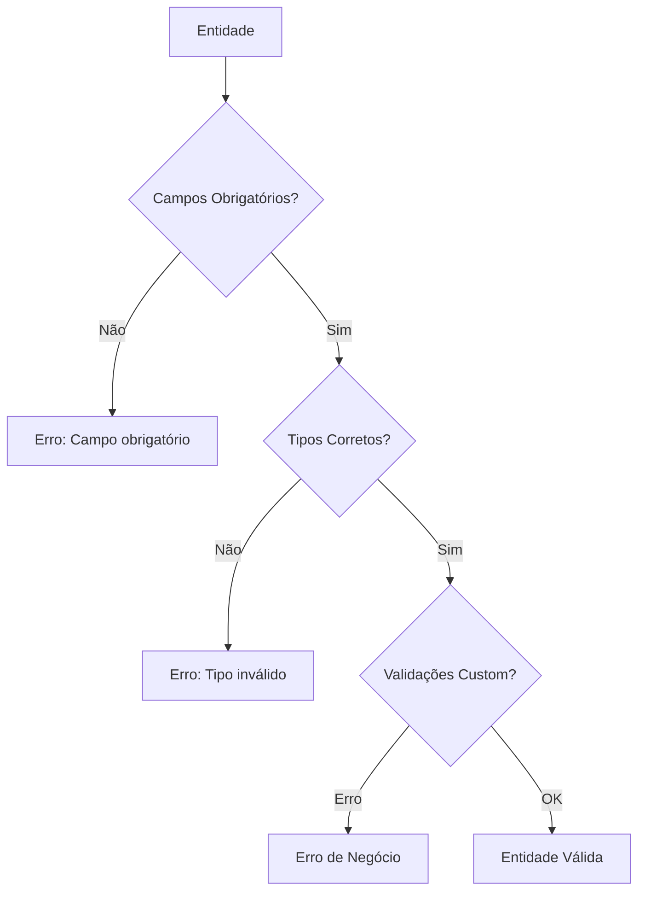
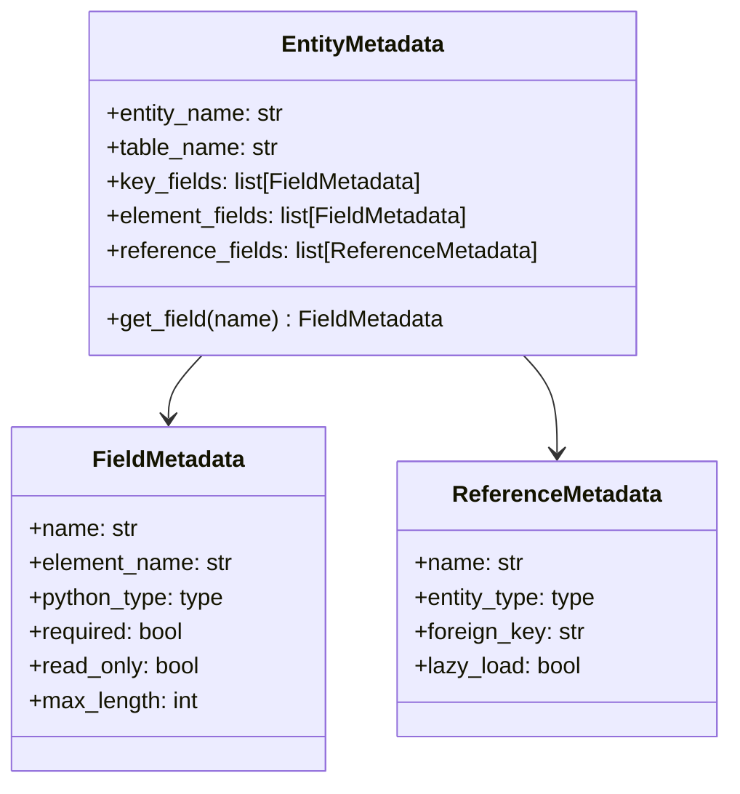

# Sistema de Entidades

Este documento explica o sistema de entidades do SDK, incluindo decoradores, serialização XML e criação de entidades customizadas.

## Visão Geral

O SDK usa um sistema de decoradores para mapear classes Python para entidades da API Sankhya:



## Decoradores Principais

### @entity

Define uma classe como entidade da API:

```python
from sankhya_sdk.attributes import entity

@entity("Parceiro", "TGFPAR")
class Partner:
    """
    Args:
        name: Nome lógico da entidade na API
        table_name: Nome da tabela no banco de dados
    """
    pass
```

**Parâmetros:**

| Parâmetro | Tipo | Obrigatório | Descrição |
|-----------|------|-------------|-----------|
| `name` | str | Sim | Nome lógico da entidade |
| `table_name` | str | Não | Nome da tabela no banco |

### @entity_key

Define o(s) campo(s) chave da entidade:

```python
from sankhya_sdk.attributes import entity, entity_key

@entity("Parceiro")
class Partner:
    @entity_key("CODPARC")
    code_partner: int
```

**Parâmetros:**

| Parâmetro | Tipo | Obrigatório | Descrição |
|-----------|------|-------------|-----------|
| `element_name` | str | Sim | Nome do campo na API |
| `auto_generated` | bool | Não | Se é gerado automaticamente |

### @entity_element

Define campos regulares da entidade:

```python
from sankhya_sdk.attributes import entity, entity_key, entity_element

@entity("Parceiro")
class Partner:
    @entity_key("CODPARC")
    code_partner: int
    
    @entity_element("NOMEPARC")
    name: str
    
    @entity_element("CGC_CPF", required=False)
    cgc_cpf: str | None = None
```

**Parâmetros:**

| Parâmetro | Tipo | Obrigatório | Descrição |
|-----------|------|-------------|-----------|
| `element_name` | str | Sim | Nome do campo na API |
| `required` | bool | Não | Se é obrigatório (default: True) |
| `read_only` | bool | Não | Apenas leitura |
| `max_length` | int | Não | Tamanho máximo |

## Entidades Pré-definidas

O SDK inclui entidades prontas para uso:

### Partner (Parceiro)

```python
from sankhya_sdk.transport_entities import Partner

partner = Partner()
partner.code_partner = 1
partner.name = "Cliente LTDA"
partner.cgc_cpf = "12345678000199"
partner.type_partner = "C"  # Cliente
```

### Product (Produto)

```python
from sankhya_sdk.transport_entities import Product

product = Product()
product.code_product = 100
product.description = "Produto Exemplo"
product.unit = "UN"
product.active = True
```

### InvoiceHeader (Cabeçalho de Nota Fiscal)

```python
from sankhya_sdk.transport_entities import InvoiceHeader
from datetime import date

header = InvoiceHeader()
header.single_number = 12345
header.code_partner = 1
header.movement_date = date.today()
header.code_company = 1
```

## Criando Entidades Customizadas

### Exemplo Básico

```python
from sankhya_sdk.attributes import entity, entity_key, entity_element
from sankhya_sdk.transport_entities import EntityBase

@entity("MeuCampo", "AD_MEUCAMPO")
class MinhaEntidade(EntityBase):
    """Entidade customizada para tabela AD_MEUCAMPO."""
    
    @entity_key("IDCAMPO")
    id_campo: int
    
    @entity_element("DESCRICAO")
    descricao: str
    
    @entity_element("VALOR", required=False)
    valor: float = 0.0
    
    @entity_element("ATIVO", required=False)
    ativo: bool = True
```

### Exemplo com Referências

```python
from sankhya_sdk.attributes import entity, entity_key, entity_element, entity_reference
from sankhya_sdk.transport_entities import EntityBase, Partner

@entity("Contato", "AD_CONTATO")
class Contato(EntityBase):
    @entity_key("IDCONTATO")
    id_contato: int
    
    @entity_element("CODPARC")
    code_partner: int
    
    @entity_element("NOME")
    nome: str
    
    @entity_element("EMAIL", required=False)
    email: str | None = None
    
    # Referência para entidade Partner
    @entity_reference("Parceiro", foreign_key="CODPARC")
    parceiro: Partner | None = None
```

### Diagrama de Herança



## Serialização XML

### Entidade para XML

```python
from sankhya_sdk.transport_entities import Partner

partner = Partner()
partner.code_partner = 1
partner.name = "Cliente LTDA"

xml = partner.to_xml()
print(xml)
```

**Saída XML:**

```xml
<entity>
    <field name="CODPARC">1</field>
    <field name="NOMEPARC">Cliente LTDA</field>
</entity>
```

### XML para Entidade

```python
from sankhya_sdk.transport_entities import Partner

xml_string = """
<entity>
    <field name="CODPARC">1</field>
    <field name="NOMEPARC">Cliente LTDA</field>
    <field name="CGC_CPF">12345678000199</field>
</entity>
"""

partner = Partner.from_xml(xml_string)
print(partner.name)  # "Cliente LTDA"
```

### Fluxo de Serialização



## Tipos de Dados Suportados

| Tipo Python | Tipo Sankhya | Serialização |
|-------------|--------------|--------------|
| `int` | Integer | Numérico |
| `float` | Decimal | Numérico com ponto |
| `str` | String | Texto |
| `bool` | Boolean | "S"/"N" ou "1"/"0" |
| `date` | Date | "dd/MM/yyyy" |
| `datetime` | DateTime | "dd/MM/yyyy HH:mm:ss" |
| `time` | Time | "HH:mm:ss" |
| `timedelta` | Duration | Segundos |
| `Decimal` | BigDecimal | Numérico preciso |

### Exemplo com Tipos Complexos

```python
from datetime import date, datetime, time
from decimal import Decimal
from sankhya_sdk.attributes import entity, entity_key, entity_element

@entity("Lancamento")
class Lancamento(EntityBase):
    @entity_key("NUMLANCAMENTO")
    numero: int
    
    @entity_element("DATALANCAMENTO")
    data: date
    
    @entity_element("DTHORALANCAMENTO")
    data_hora: datetime
    
    @entity_element("HORAENTRADA")
    hora_entrada: time
    
    @entity_element("VALOR")
    valor: Decimal
    
    @entity_element("ATIVO")
    ativo: bool
```

## Validações

### Validador de Entidade

```python
from sankhya_sdk.validations import EntityValidator

partner = Partner()
partner.name = "Cliente"  # Faltando código (chave)

validator = EntityValidator()
result = validator.validate(partner)

if not result.is_valid:
    for error in result.errors:
        print(f"Erro: {error.message}")
```

### Validações Customizadas

```python
from sankhya_sdk.validations import EntityValidation

class MinhaEntidade(EntityBase):
    @entity_key("ID")
    id: int
    
    @entity_element("VALOR")
    valor: float
    
    def validate(self) -> list[EntityValidation]:
        errors = super().validate()
        
        if self.valor < 0:
            errors.append(EntityValidation(
                field="valor",
                message="Valor não pode ser negativo"
            ))
        
        return errors
```

### Fluxo de Validação



## Metadados de Entidade

### Acessando Metadados

```python
from sankhya_sdk.attributes import get_entity_metadata

metadata = get_entity_metadata(Partner)

print(f"Nome: {metadata.entity_name}")
print(f"Tabela: {metadata.table_name}")
print(f"Chaves: {metadata.key_fields}")
print(f"Campos: {metadata.element_fields}")
```

### Estrutura de Metadados



## Boas Práticas

### 1. Use Nomes Descritivos

```python
# ✅ Bom
@entity_element("NOMEPARC")
name: str

# ❌ Evitar
@entity_element("NOMEPARC")
np: str
```

### 2. Documente Entidades Customizadas

```python
@entity("Contato", "AD_CONTATO")
class Contato(EntityBase):
    """
    Entidade de contatos de parceiros.
    
    Tabela: AD_CONTATO (customizada)
    
    Attributes:
        id_contato: Identificador único
        code_partner: Código do parceiro relacionado
        nome: Nome do contato
        email: E-mail do contato (opcional)
    """
    ...
```

### 3. Use Valores Default Apropriados

```python
@entity_element("ATIVO", required=False)
ativo: bool = True  # Default sensato

@entity_element("VALOR", required=False)
valor: Decimal = Decimal("0.00")  # Tipo correto
```

### 4. Valide Antes de Persistir

```python
from sankhya_sdk.validations import EntityValidator

def save_entity(entity: EntityBase):
    validator = EntityValidator()
    result = validator.validate(entity)
    
    if not result.is_valid:
        raise ValueError(f"Entidade inválida: {result.errors}")
    
    return crud.insert(entity)
```

## Próximos Passos

- [Tratamento de Erros](error-handling.md) - Estratégias de erro
- [Exemplos: Entidades Customizadas](../examples/custom-entities.md) - Exemplos práticos
- [Referência: Validações](../api-reference/validations.md) - API de validação
