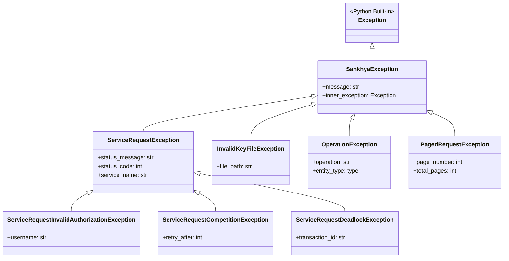
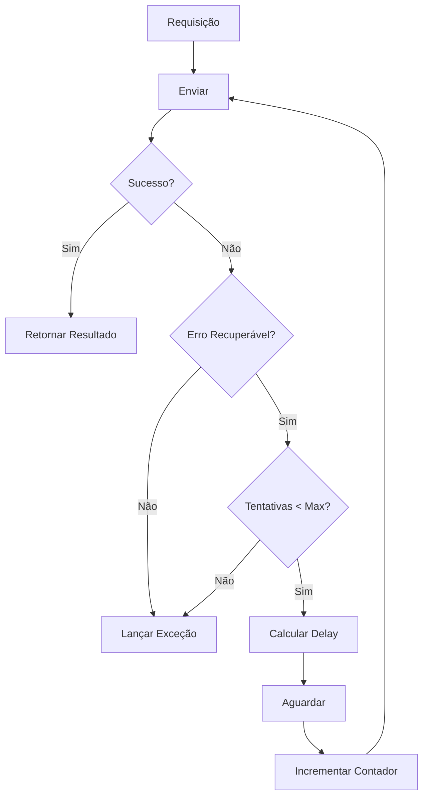

# Tratamento de Erros

Este documento explica a hierarquia de exceções do SDK, estratégias de retry e boas práticas de tratamento de erros.

## Hierarquia de Exceções

O SDK define uma hierarquia clara de exceções para diferentes tipos de erros:



## Exceções Principais

### SankhyaException

Classe base para todas as exceções do SDK:

```python
from sankhya_sdk.exceptions import SankhyaException

try:
    # operação
except SankhyaException as e:
    print(f"Erro Sankhya: {e.message}")
    if e.inner_exception:
        print(f"Causa: {e.inner_exception}")
```

### ServiceRequestException

Erro durante comunicação com a API:

```python
from sankhya_sdk.exceptions import ServiceRequestException

try:
    result = wrapper.find(Partner, "CODPARC > 0")
except ServiceRequestException as e:
    print(f"Serviço: {e.service_name}")
    print(f"Status: {e.status_code}")
    print(f"Mensagem: {e.status_message}")
```

### ServiceRequestInvalidAuthorizationException

Credenciais inválidas:

```python
from sankhya_sdk.exceptions import ServiceRequestInvalidAuthorizationException

try:
    ctx = SankhyaContext.from_settings()
except ServiceRequestInvalidAuthorizationException as e:
    print(f"Usuário inválido: {e.username}")
    # Não adianta retry - credenciais erradas
```

### ServiceRequestCompetitionException

Erro de concorrência/lock:

```python
from sankhya_sdk.exceptions import ServiceRequestCompetitionException

try:
    crud.update(entity)
except ServiceRequestCompetitionException as e:
    print(f"Recurso bloqueado, retry em: {e.retry_after}s")
    time.sleep(e.retry_after)
    crud.update(entity)  # Tentar novamente
```

### ServiceRequestDeadlockException

Deadlock no banco de dados:

```python
from sankhya_sdk.exceptions import ServiceRequestDeadlockException

try:
    crud.update(entity)
except ServiceRequestDeadlockException as e:
    print(f"Deadlock na transação: {e.transaction_id}")
    # SDK deve fazer retry automaticamente
```

## Retry Automático

O SDK implementa retry automático com backoff exponencial:



### Configurando Retry

```python
from sankhya_sdk.request_helpers import RequestBehaviorOptions
from sankhya_sdk.core.settings import SankhyaSettings

settings = SankhyaSettings(
    base_url="https://api.sankhya.com.br",
    username="usuario",
    password="senha",
    request_behavior=RequestBehaviorOptions(
        max_retry_count=5,          # Máximo de tentativas
        retry_delay_ms=1000,        # Delay inicial (1s)
        backoff_multiplier=2.0,     # Multiplicador exponencial
        max_retry_delay_ms=30000,   # Delay máximo (30s)
    )
)
```

### Fórmula de Backoff

```
delay = min(retry_delay_ms * (backoff_multiplier ^ attempt), max_retry_delay_ms)
```

**Exemplo com configuração padrão:**

| Tentativa | Cálculo | Delay |
|-----------|---------|-------|
| 1 | 1000 * 2^0 | 1s |
| 2 | 1000 * 2^1 | 2s |
| 3 | 1000 * 2^2 | 4s |
| 4 | 1000 * 2^3 | 8s |
| 5 | 1000 * 2^4 | 16s |

### Erros Recuperáveis vs Não Recuperáveis

| Tipo de Erro | Recuperável | Ação |
|--------------|-------------|------|
| Timeout | ✅ | Retry |
| Sessão Expirada | ✅ | Reautenticar + Retry |
| Deadlock | ✅ | Retry |
| Competition | ✅ | Retry com delay |
| Credenciais Inválidas | ❌ | Falhar imediatamente |
| Erro de Validação | ❌ | Falhar imediatamente |
| Erro de Negócio | ❌ | Falhar imediatamente |

## Tratamento Manual de Erros

### Padrão Básico

```python
from sankhya_sdk import SankhyaContext
from sankhya_sdk.exceptions import (
    SankhyaException,
    ServiceRequestException,
    ServiceRequestInvalidAuthorizationException,
)

try:
    with SankhyaContext.from_settings() as ctx:
        result = ctx.wrapper.find(Partner, "CODPARC > 0")
        
except ServiceRequestInvalidAuthorizationException:
    # Credenciais incorretas - não adianta retry
    logging.error("Credenciais inválidas")
    sys.exit(1)
    
except ServiceRequestException as e:
    # Erro de comunicação com API
    logging.error(f"Erro API: {e.status_message} ({e.status_code})")
    
except SankhyaException as e:
    # Outros erros do SDK
    logging.error(f"Erro SDK: {e.message}")
    
except Exception as e:
    # Erros inesperados
    logging.exception(f"Erro inesperado: {e}")
```

### Padrão com Retry Manual

```python
import time
from sankhya_sdk.exceptions import ServiceRequestCompetitionException

def update_with_retry(crud, entity, max_retries=3):
    """Atualiza com retry manual para erros de concorrência."""
    for attempt in range(max_retries):
        try:
            return crud.update(entity)
        except ServiceRequestCompetitionException as e:
            if attempt < max_retries - 1:
                delay = e.retry_after or (2 ** attempt)
                logging.warning(f"Retry em {delay}s (tentativa {attempt + 1})")
                time.sleep(delay)
            else:
                raise
```

### Padrão com Circuit Breaker

```python
from datetime import datetime, timedelta

class CircuitBreaker:
    def __init__(self, failure_threshold=5, recovery_time=60):
        self.failure_count = 0
        self.failure_threshold = failure_threshold
        self.recovery_time = timedelta(seconds=recovery_time)
        self.last_failure_time = None
        self.state = "closed"  # closed, open, half-open
    
    def call(self, func, *args, **kwargs):
        if self.state == "open":
            if datetime.now() - self.last_failure_time > self.recovery_time:
                self.state = "half-open"
            else:
                raise ServiceRequestException("Circuit breaker open")
        
        try:
            result = func(*args, **kwargs)
            self.reset()
            return result
        except ServiceRequestException:
            self.record_failure()
            raise
    
    def record_failure(self):
        self.failure_count += 1
        self.last_failure_time = datetime.now()
        if self.failure_count >= self.failure_threshold:
            self.state = "open"
    
    def reset(self):
        self.failure_count = 0
        self.state = "closed"

# Uso
breaker = CircuitBreaker()

try:
    result = breaker.call(crud.find, Partner, "CODPARC > 0")
except ServiceRequestException as e:
    if "Circuit breaker open" in str(e):
        # Sistema indisponível, usar fallback
        result = get_cached_data()
```

## Logging de Erros

### Configuração Recomendada

```python
import logging
import json
from datetime import datetime

# Configuração de logging
logging.basicConfig(
    level=logging.INFO,
    format='%(asctime)s - %(name)s - %(levelname)s - %(message)s',
    handlers=[
        logging.FileHandler('sankhya_sdk.log'),
        logging.StreamHandler()
    ]
)

# Logger específico para erros
error_logger = logging.getLogger('sankhya_sdk.errors')
error_logger.setLevel(logging.ERROR)
```

### Capturar Contexto de Erro

```python
def log_error_with_context(error: SankhyaException, context: dict):
    """Registra erro com contexto adicional."""
    error_data = {
        "timestamp": datetime.now().isoformat(),
        "error_type": type(error).__name__,
        "message": str(error),
        "context": context,
    }
    
    if isinstance(error, ServiceRequestException):
        error_data["service"] = error.service_name
        error_data["status_code"] = error.status_code
    
    error_logger.error(json.dumps(error_data, indent=2))

# Uso
try:
    crud.update(entity)
except SankhyaException as e:
    log_error_with_context(e, {
        "entity_type": "Partner",
        "entity_id": entity.code_partner,
        "operation": "update"
    })
    raise
```

## Mensagens de Status

O SDK fornece helpers para interpretar mensagens de status:

```python
from sankhya_sdk.helpers import StatusMessageHelper

try:
    result = wrapper.invoke_service("ServiceName", request)
except ServiceRequestException as e:
    # Interpretar mensagem de status
    parsed = StatusMessageHelper.parse(e.status_message)
    
    print(f"Tipo: {parsed.type}")        # ERROR, WARNING, INFO
    print(f"Código: {parsed.code}")      # Código interno
    print(f"Mensagem: {parsed.message}") # Mensagem amigável
    print(f"Detalhes: {parsed.details}") # Informações adicionais
```

### Tipos de Status

| Tipo | Descrição | Ação |
|------|-----------|------|
| `ERROR` | Erro que impede operação | Falhar ou retry |
| `WARNING` | Aviso, operação pode continuar | Log e continuar |
| `INFO` | Informação | Ignorar ou log |
| `VALIDATION` | Erro de validação | Corrigir dados |

## Boas Práticas

### 1. Seja Específico no Catch

```python
# ✅ Bom - específico
try:
    crud.update(entity)
except ServiceRequestInvalidAuthorizationException:
    # Tratar autenticação
except ServiceRequestCompetitionException:
    # Tratar concorrência
except ServiceRequestException:
    # Outros erros de requisição
except SankhyaException:
    # Outros erros do SDK

# ❌ Evitar - genérico demais
try:
    crud.update(entity)
except Exception:
    # Não sabe o que aconteceu
```

### 2. Não Engula Exceções

```python
# ✅ Bom - log e propaga
try:
    crud.update(entity)
except SankhyaException as e:
    logging.error(f"Erro: {e}")
    raise

# ❌ Evitar - engole exceção
try:
    crud.update(entity)
except SankhyaException:
    pass  # Silencioso, problema será difícil de debugar
```

### 3. Use Contexto Adequado

```python
# ✅ Bom - adiciona contexto
try:
    crud.update(entity)
except SankhyaException as e:
    raise OperationException(
        f"Falha ao atualizar parceiro {entity.code_partner}",
        inner_exception=e
    )
```

### 4. Implemente Fallbacks

```python
def get_partner(code: int) -> Partner | None:
    """Busca parceiro com fallback para cache."""
    try:
        partners = crud.find(Partner, f"CODPARC = {code}")
        return partners[0] if partners else None
    except ServiceRequestException:
        # Fallback para cache local
        return cache.get(f"partner:{code}")
```

### 5. Monitore Erros

```python
from collections import Counter

error_counter = Counter()

def monitored_operation(func):
    """Decorator que monitora erros."""
    def wrapper(*args, **kwargs):
        try:
            return func(*args, **kwargs)
        except SankhyaException as e:
            error_counter[type(e).__name__] += 1
            raise
    return wrapper

@monitored_operation
def update_partner(partner: Partner):
    return crud.update(partner)

# Relatório periódico
def error_report():
    for error_type, count in error_counter.most_common():
        print(f"{error_type}: {count} ocorrências")
```

## Próximos Passos

- [Exemplos: Tratamento de Erros](../examples/error-handling.md) - Exemplos práticos
- [Referência: Exceções](../api-reference/exceptions.md) - API completa
- [Request Helpers](../api-reference/helpers.md) - Configuração de retry
