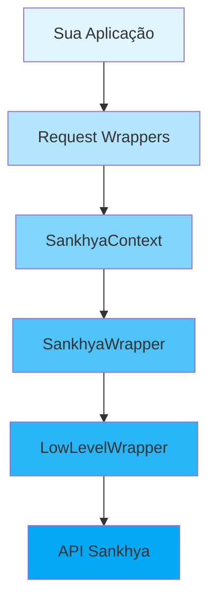

# Conceitos Fundamentais

Esta seção explica os conceitos fundamentais do Sankhya SDK Python, essenciais para entender como o SDK funciona e como utilizá-lo efetivamente.

## Tópicos

-   :material-layers:{ .lg .middle } __Arquitetura__

    ---

    Entenda a arquitetura em camadas do SDK e como os componentes se integram.

    [:octicons-arrow-right-24: Arquitetura](architecture.md)

-   :material-connection:{ .lg .middle } __Gerenciamento de Sessões__

    ---

    Aprenda sobre ciclo de vida de sessões, concorrência e multi-threading.

    [:octicons-arrow-right-24: Sessões](session-management.md)

-   :material-code-tags:{ .lg .middle } __Sistema de Entidades__

    ---

    Decoradores, serialização XML e criação de entidades customizadas.

    [:octicons-arrow-right-24: Entidades](entity-system.md)

-   :material-alert-circle:{ .lg .middle } __Tratamento de Erros__

    ---

    Hierarquia de exceções, retry automático e estratégias de recuperação.

    [:octicons-arrow-right-24: Erros](error-handling.md)

## Visão Geral

O SDK segue uma arquitetura em camadas que separa responsabilidades:

Cada camada tem uma responsabilidade específica, permitindo flexibilidade e manutenibilidade.
