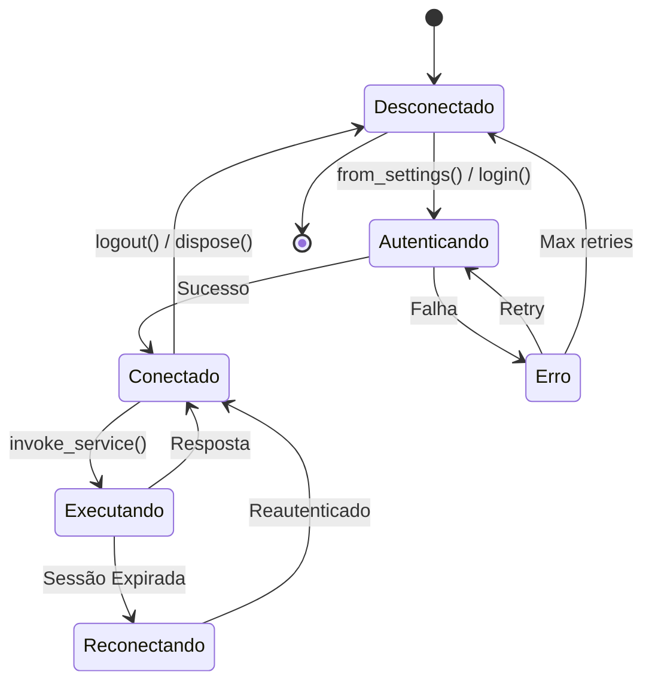
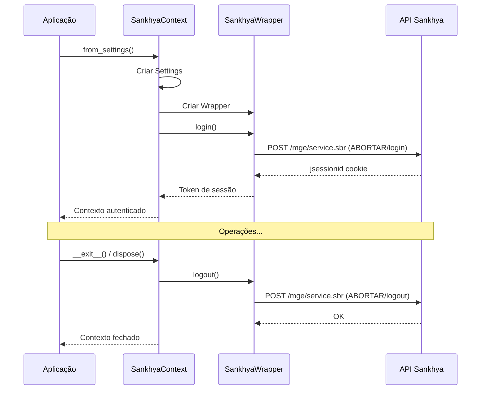
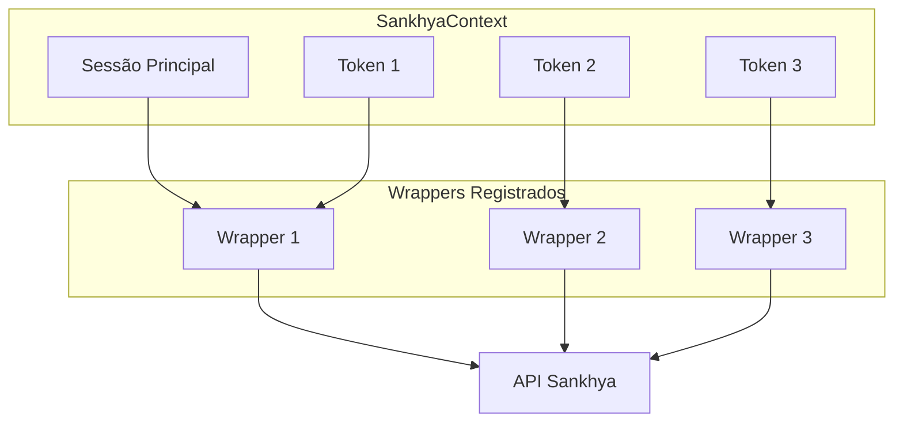
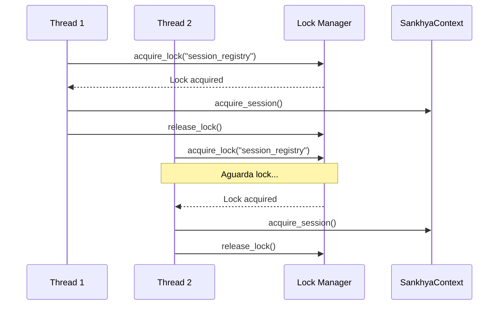
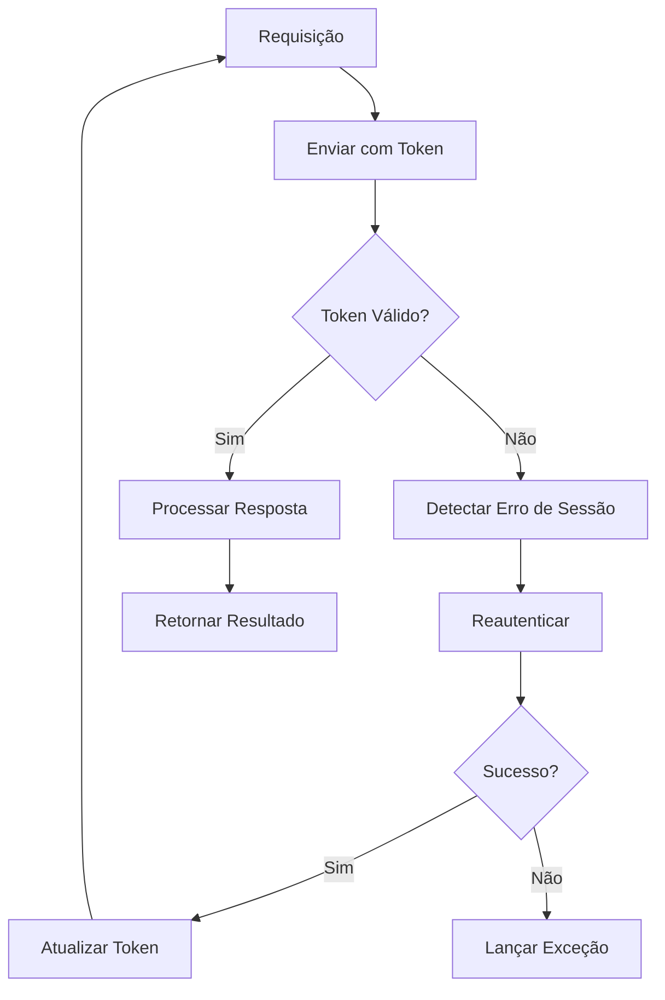

# Gerenciamento de Sessões

Este documento explica como o Sankhya SDK gerencia sessões de autenticação, incluindo sessões únicas, múltiplas sessões e considerações de concorrência.

## Visão Geral

O SDK oferece dois modos de gerenciamento de sessões:

| Modo | Descrição | Uso Típico |
|------|-----------|------------|
| **Sessão Única** | Uma sessão por contexto | Aplicações simples, scripts |
| **Múltiplas Sessões** | Várias sessões simultâneas | Aplicações multi-thread, APIs |

## Ciclo de Vida de Sessões



## Sessão Única

### Uso Básico

O modo mais simples, usando context manager:

```python
from sankhya_sdk import SankhyaContext

# Sessão abre automaticamente
with SankhyaContext.from_settings() as ctx:
    # Operações aqui
    resultado = ctx.wrapper.find(Partner, "CODPARC > 0")
# Sessão fecha automaticamente (logout)
```

### Fluxo de Autenticação



### Sem Context Manager

Para controle manual do ciclo de vida:

```python
from sankhya_sdk import SankhyaContext

ctx = SankhyaContext.from_settings()
try:
    # Operações
    resultado = ctx.wrapper.find(Partner, "CODPARC > 0")
finally:
    ctx.dispose()  # Importante: sempre chamar dispose()
```

!!! warning "Importante"
    Sempre chame `dispose()` quando não usar context manager para evitar sessões órfãs.

## Múltiplas Sessões

Para aplicações que precisam de paralelismo ou isolamento de operações.

### Adquirindo Sessões

```python
from sankhya_sdk import SankhyaContext

# Cria contexto principal
ctx = SankhyaContext.from_settings()

# Adquire sessões adicionais
token1 = ctx.acquire_session()  # Retorna UUID
token2 = ctx.acquire_session()

print(f"Sessão 1: {token1}")
print(f"Sessão 2: {token2}")

# Usa sessões
result1 = ctx.invoke_with_token(token1, "ServiceName", request1)
result2 = ctx.invoke_with_token(token2, "ServiceName", request2)

# Finaliza sessões
ctx.finalize_session(token1)
ctx.finalize_session(token2)

ctx.dispose()
```

### Diagrama de Múltiplas Sessões



### Detachando Sessões

Para transferir uma sessão para outro contexto ou processo:

```python
# Processo 1: Cria e detacha sessão
ctx1 = SankhyaContext.from_settings()
token = ctx1.acquire_session()
wrapper_serializado = ctx1.detach_session(token)

# Processo 2: Usa sessão detachada
ctx2 = SankhyaContext.from_settings()
ctx2.attach_session(token, wrapper_serializado)
result = ctx2.invoke_with_token(token, "ServiceName", request)
```

## Thread Safety

O SDK é thread-safe por design. Cada thread pode usar sessões independentes.

### Exemplo Multi-threaded

```python
import threading
from concurrent.futures import ThreadPoolExecutor
from sankhya_sdk import SankhyaContext
from sankhya_sdk.request_wrappers import SimpleCRUDRequestWrapper

ctx = SankhyaContext.from_settings()

def process_batch(batch_id: int, items: list):
    """Processa um lote em uma thread separada."""
    token = ctx.acquire_session()
    try:
        # Cada thread tem sua própria sessão
        for item in items:
            result = ctx.invoke_with_token(
                token, 
                "CRUDServiceProvider.saveRecord",
                build_request(item)
            )
            print(f"Batch {batch_id}: Processado item {item['id']}")
    finally:
        ctx.finalize_session(token)

# Divide trabalho em lotes
all_items = [...]  # Lista de items
batches = [all_items[i:i+100] for i in range(0, len(all_items), 100)]

# Processa em paralelo
with ThreadPoolExecutor(max_workers=5) as executor:
    futures = [
        executor.submit(process_batch, i, batch)
        for i, batch in enumerate(batches)
    ]
    
    for future in futures:
        future.result()  # Aguarda conclusão

ctx.dispose()
```

### Locks Internos

O SDK usa locks para operações críticas:



## Async/Await

Para aplicações assíncronas (requires `httpx` e `aiofiles`):

```python
import asyncio
from sankhya_sdk import AsyncSankhyaContext

async def main():
    async with AsyncSankhyaContext.from_settings() as ctx:
        # Operações assíncronas
        partners = await ctx.wrapper.find_async(Partner, "CODPARC > 0")
        
        # Múltiplas requisições em paralelo
        tasks = [
            ctx.wrapper.find_async(Partner, f"CODPARC = {i}")
            for i in range(1, 10)
        ]
        results = await asyncio.gather(*tasks)

asyncio.run(main())
```

### Múltiplas Sessões Assíncronas

```python
async def process_with_session(ctx, item):
    """Processa item com sessão própria."""
    token = await ctx.acquire_session_async()
    try:
        result = await ctx.invoke_with_token_async(
            token, "ServiceName", build_request(item)
        )
        return result
    finally:
        await ctx.finalize_session_async(token)

async def main():
    async with AsyncSankhyaContext.from_settings() as ctx:
        items = [...]
        
        # Processa todos em paralelo
        results = await asyncio.gather(*[
            process_with_session(ctx, item)
            for item in items
        ])
```

## Renovação de Token

O SDK gerencia automaticamente tokens expirados:



### Configurando Timeout de Sessão

```python
from sankhya_sdk.core.settings import SankhyaSettings

settings = SankhyaSettings(
    base_url="https://api.sankhya.com.br",
    username="usuario",
    password="senha",
    session_timeout=300,  # 5 minutos
    auto_renew_session=True  # Renovação automática
)

ctx = SankhyaContext(settings)
```

## Boas Práticas

### 1. Use Context Managers

```python
# ✅ Correto
with SankhyaContext.from_settings() as ctx:
    ...

# ❌ Evitar (pode deixar sessões abertas)
ctx = SankhyaContext.from_settings()
...
# Se exceção ocorrer aqui, sessão não fecha
```

### 2. Limite Sessões Simultâneas

```python
from concurrent.futures import ThreadPoolExecutor

# ✅ Limitar workers
with ThreadPoolExecutor(max_workers=5) as executor:
    ...

# ❌ Evitar muitas sessões
with ThreadPoolExecutor(max_workers=100) as executor:
    # Pode exceder limite do servidor
    ...
```

### 3. Feche Sessões Não Utilizadas

```python
# ✅ Finalizar explicitamente
token = ctx.acquire_session()
try:
    # operações
finally:
    ctx.finalize_session(token)

# ❌ Não deixar sessões abertas
token = ctx.acquire_session()
# operações (se exceção, sessão fica aberta)
```

### 4. Trate Erros de Sessão

```python
from sankhya_sdk.exceptions import (
    ServiceRequestInvalidAuthorizationException,
    ServiceRequestException,
)

try:
    result = ctx.wrapper.find(Partner, "CODPARC > 0")
except ServiceRequestInvalidAuthorizationException:
    # Credenciais inválidas - não adianta retry
    raise
except ServiceRequestException as e:
    if "session expired" in str(e).lower():
        # Sessão expirada - SDK deve reautenticar automaticamente
        # Se chegou aqui, algo está errado
        ctx.dispose()
        ctx = SankhyaContext.from_settings()
        result = ctx.wrapper.find(Partner, "CODPARC > 0")
```

## Monitoramento

### Logging de Sessões

```python
import logging

# Configura logging detalhado
logging.basicConfig(level=logging.DEBUG)
logger = logging.getLogger('sankhya_sdk.session')
logger.setLevel(logging.DEBUG)

# Logs incluirão:
# - Login/logout
# - Aquisição/liberação de sessões
# - Renovação de tokens
# - Erros de autenticação
```

### Métricas de Sessão

```python
# Obtém estatísticas
stats = ctx.get_session_stats()
print(f"Sessões ativas: {stats['active_sessions']}")
print(f"Total de sessões criadas: {stats['total_created']}")
print(f"Sessões finalizadas: {stats['total_finalized']}")
print(f"Renovações de token: {stats['token_renewals']}")
```

## Próximos Passos

- [Sistema de Entidades](entity-system.md) - Criação de entidades
- [Tratamento de Erros](error-handling.md) - Estratégias de erro
- [Exemplos](../examples/session-management.md) - Exemplos práticos
