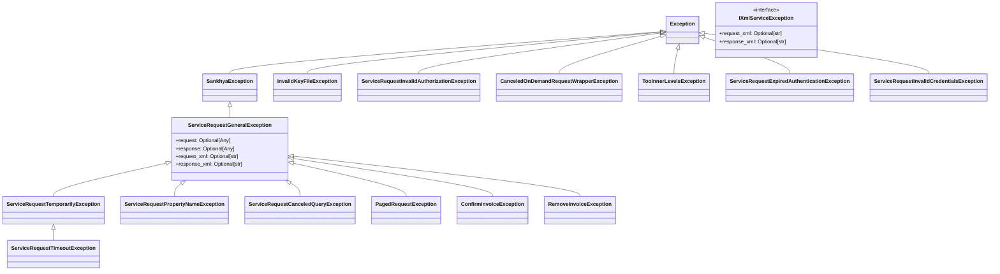

# Hierarquia de Exceções

O Sankhya SDK utiliza uma hierarquia robusta de exceções para fornecer informações detalhadas sobre erros que ocorrem durante a interação com o web service do Sankhya.

## Estrutura Principal

A base de todas as exceções customizadas é a `SankhyaException`. Para erros relacionados a requisições de serviço, a base é `ServiceRequestGeneralException`, que implementa o protocolo `IXmlServiceException`.

### Diagrama da Hierarquia



## Categorias de Exceções

### Autenticação e Autorização

Usadas para erros relacionados ao processo de login e permissões.

- `ServiceRequestInvalidAuthorizationException`: Acesso não autorizado.
- `ServiceRequestInvalidCredentialsException`: Credenciais inválidas.
- `ServiceRequestExpiredAuthenticationException`: Sessão expirada.

### Erros de Validação de Requisição

Lançadas quando os dados enviados na requisição não estão em conformidade com o esperado pelo Sankhya.

- `ServiceRequestPropertyNameException`: Campo não encontrado na entidade.
- `ServiceRequestPropertyValueException`: Valor do campo inválido.
- `ServiceRequestPropertyWidthException`: Tamanho do valor excede o permitido.
- `ServiceRequestAttributeException`: Atributo obrigatório ausente.

### Erros Temporários e Infraestrutura

Erros que podem ser resolvidos com uma nova tentativa (retry).

- `ServiceRequestTemporarilyException`: Erro temporário genérico.
- `ServiceRequestTimeoutException`: Tempo limite da requisição excedido.
- `ServiceRequestInaccessibleException`: Servidor Sankhya inacessível.
- `ServiceRequestUnavailableException`: Serviço temporariamente indisponível.

### Erros de Operação de Negócio

Lançadas durante operações específicas como confirmação de nota fiscal.

- `ConfirmInvoiceException`: Erro ao confirmar nota.
- `NoItemsConfirmInvoiceException`: Tentativa de confirmar nota sem itens.
- `RemoveInvoiceException`: Erro ao remover nota.

## Como Usar

Todas as exceções estão disponíveis no módulo `sankhya_sdk.exceptions`.

```python
from sankhya_sdk.exceptions import SankhyaException, ServiceRequestTimeoutException

try:
    # Executa operação no SDK
    ...
except ServiceRequestTimeoutException:
    # Trata timeout especificamente
    ...
except SankhyaException as e:
    # Trata qualquer erro do SDK
    print(f"Erro no SDK: {e}")
```

Ao capturar uma `ServiceRequestGeneralException`, você pode acessar o XML da requisição e da resposta (se disponíveis):

```python
except ServiceRequestGeneralException as e:
    print(f"Request XML: {e.request_xml}")
    print(f"Response XML: {e.response_xml}")
```
