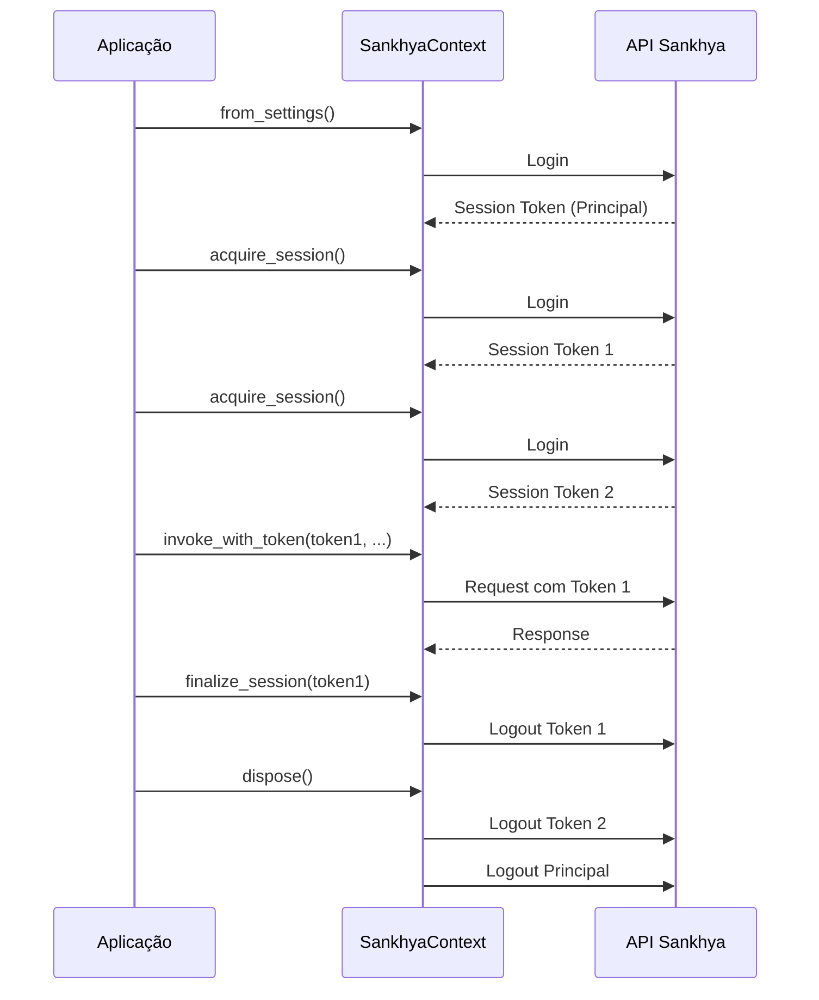

# Autenticação

Este guia detalha os métodos de autenticação disponíveis no SDK e boas práticas de segurança.

## Visão Geral

O Sankhya SDK suporta múltiplos métodos de autenticação:

| Método | Segurança | Uso Recomendado |
|--------|-----------|-----------------|
| Variáveis de ambiente | ⭐⭐⭐ | Desenvolvimento e CI/CD |
| Arquivo .key | ⭐⭐⭐⭐ | Produção |
| Configuração direta | ⭐⭐ | Testes |

## Método 1: Variáveis de Ambiente

### Configuração

Crie um arquivo `.env`:

```ini
SANKHYA_BASE_URL=https://api.sankhya.com.br
SANKHYA_USERNAME=seu_usuario
SANKHYA_PASSWORD=sua_senha
SANKHYA_ENVIRONMENT=producao
```

### Uso

```python
from sankhya_sdk import SankhyaContext
from dotenv import load_dotenv

load_dotenv()

with SankhyaContext.from_settings() as ctx:
    print(f"Autenticado como: {ctx.user_code}")
```

### Variáveis Disponíveis

| Variável | Obrigatória | Descrição |
|----------|-------------|-----------|
| `SANKHYA_BASE_URL` | Sim | URL base da API |
| `SANKHYA_USERNAME` | Sim | Nome de usuário |
| `SANKHYA_PASSWORD` | Sim | Senha do usuário |
| `SANKHYA_ENVIRONMENT` | Não | Ambiente (producao/homologacao/treinamento) |
| `SANKHYA_TIMEOUT` | Não | Timeout em segundos (padrão: 30) |
| `SANKHYA_MAX_RETRIES` | Não | Máximo de tentativas (padrão: 3) |
| `SANKHYA_LOG_LEVEL` | Não | Nível de log (DEBUG/INFO/WARNING/ERROR) |

## Método 2: Arquivo .key

Para maior segurança em produção, use arquivos de chave encriptados.

### Criando um Arquivo .key

```python
from sankhya_sdk.core.settings import SankhyaSettings

# Cria configurações
settings = SankhyaSettings(
    base_url="https://api.sankhya.com.br",
    username="seu_usuario",
    password="sua_senha",
    environment="producao"
)

# Exporta para arquivo .key (encriptado)
settings.to_key_file("credenciais.key", passphrase="sua_frase_secreta")
```

### Usando um Arquivo .key

```python
from sankhya_sdk import SankhyaContext
from sankhya_sdk.core.settings import SankhyaSettings

# Carrega do arquivo .key
settings = SankhyaSettings.from_key_file(
    "credenciais.key",
    passphrase="sua_frase_secreta"
)

with SankhyaContext(settings) as ctx:
    print(f"Autenticado via .key: {ctx.user_code}")
```

!!! warning "Segurança"
    - Nunca versione arquivos `.key`
    - Armazene a passphrase em um gerenciador de segredos
    - Use permissões de arquivo restritivas (chmod 600)

## Método 3: Configuração Direta

Para testes e desenvolvimento rápido:

```python
from sankhya_sdk import SankhyaContext
from sankhya_sdk.core.settings import SankhyaSettings

settings = SankhyaSettings(
    base_url="https://api.sankhya.com.br",
    username="usuario_teste",
    password="senha_teste"
)

with SankhyaContext(settings) as ctx:
    # ...
```

!!! danger "Aviso"
    Nunca use credenciais hardcoded em código de produção!

## Gerenciamento de Sessões

### Sessão Única (Padrão)

O context manager gerencia automaticamente login/logout:

```python
with SankhyaContext.from_settings() as ctx:
    # Sessão aberta
    resultado = ctx.wrapper.find(...)
# Sessão fechada (logout automático)
```

### Múltiplas Sessões

Para aplicações que precisam de múltiplas sessões simultâneas:

```python
from sankhya_sdk import SankhyaContext

# Cria contexto principal
ctx = SankhyaContext.from_settings()

# Adquire sessões adicionais
token1 = ctx.acquire_session()
token2 = ctx.acquire_session()

# Usa sessões específicas
result1 = ctx.invoke_with_token(token1, service_name, request)
result2 = ctx.invoke_with_token(token2, service_name, request)

# Finaliza sessões
ctx.finalize_session(token1)
ctx.finalize_session(token2)

# Fecha contexto principal
ctx.dispose()
```



### Thread Safety

O SDK é thread-safe. Para aplicações multi-thread:

```python
import threading
from sankhya_sdk import SankhyaContext

ctx = SankhyaContext.from_settings()

def worker(thread_id):
    """Cada thread usa uma sessão separada."""
    token = ctx.acquire_session()
    try:
        # Operações usando invoke_with_token
        result = ctx.invoke_with_token(token, "ServiceName", request)
        print(f"Thread {thread_id}: {result}")
    finally:
        ctx.finalize_session(token)

# Cria threads
threads = [
    threading.Thread(target=worker, args=(i,))
    for i in range(5)
]

# Inicia threads
for t in threads:
    t.start()

# Aguarda conclusão
for t in threads:
    t.join()

ctx.dispose()
```

## Renovação Automática de Token

O SDK gerencia automaticamente a renovação de tokens expirados:

```python
with SankhyaContext.from_settings() as ctx:
    # Se o token expirar durante uma operação,
    # o SDK automaticamente:
    # 1. Detecta o erro de autenticação
    # 2. Faz login novamente
    # 3. Repete a operação
    
    for i in range(1000):  # Operação longa
        crud.find(Partner, f"CODPARC = {i}")
        # Token renovado automaticamente se necessário
```

## Boas Práticas de Segurança

### 1. Nunca Versione Credenciais

```gitignore
# .gitignore
.env
.env.*
*.key
credentials/
```

### 2. Use Variáveis de Ambiente em CI/CD

```yaml
# GitHub Actions
env:
  SANKHYA_BASE_URL: ${{ secrets.SANKHYA_URL }}
  SANKHYA_USERNAME: ${{ secrets.SANKHYA_USER }}
  SANKHYA_PASSWORD: ${{ secrets.SANKHYA_PASS }}
```

### 3. Rotacione Credenciais Regularmente

```python
# Script de rotação (executar periodicamente)
from sankhya_sdk.core.settings import SankhyaSettings

old_settings = SankhyaSettings.from_key_file("old.key", passphrase)
new_settings = SankhyaSettings(
    base_url=old_settings.base_url,
    username=old_settings.username,
    password=new_password  # Nova senha
)
new_settings.to_key_file("new.key", new_passphrase)
```

### 4. Use Usuários com Permissões Mínimas

Crie usuários específicos para cada integração com apenas as permissões necessárias:

| Integração | Permissões |
|------------|------------|
| Sincronização de Produtos | Leitura de produtos |
| Faturamento | CRUD de notas fiscais |
| Relatórios | Leitura geral |

### 5. Monitore Acessos

```python
import logging

logging.basicConfig(level=logging.INFO)
logger = logging.getLogger('sankhya_sdk.auth')

# Cada login/logout será registrado
with SankhyaContext.from_settings() as ctx:
    # [INFO] Login successful: user=admin, session=abc123
    ...
# [INFO] Logout: session=abc123
```

## Configuração por Ambiente

### Estrutura Recomendada

```
config/
├── .env.development
├── .env.staging
├── .env.production
└── credentials/
    ├── dev.key
    ├── staging.key
    └── prod.key
```

### Carregamento Dinâmico

```python
import os
from dotenv import load_dotenv
from sankhya_sdk import SankhyaContext

# Determina ambiente
env = os.getenv("APP_ENV", "development")

# Carrega arquivo correspondente
load_dotenv(f"config/.env.{env}")

with SankhyaContext.from_settings() as ctx:
    print(f"Conectado ao ambiente: {env}")
```

## Solução de Problemas

### Erro: Invalid Credentials

```python
ServiceRequestInvalidAuthorizationException: Invalid credentials
```

**Verificações:**

1. Usuário e senha corretos
2. Usuário tem acesso à API
3. Ambiente correto (produção vs homologação)

### Erro: Session Expired

```python
ServiceRequestException: Session expired
```

**Solução:** O SDK deve renovar automaticamente. Se persistir:

```python
ctx.wrapper.logout()
ctx.wrapper.login()
```

### Erro: Too Many Sessions

```python
ServiceRequestException: Maximum sessions exceeded
```

**Solução:**

1. Feche sessões não utilizadas
2. Use `dispose()` corretamente
3. Aguarde expiração de sessões antigas

## Próximos Passos

- [Arquitetura](../core-concepts/architecture.md) - Entenda a estrutura do SDK
- [Gerenciamento de Sessões](../core-concepts/session-management.md) - Detalhes avançados
- [Tratamento de Erros](../core-concepts/error-handling.md) - Estratégias de erro
