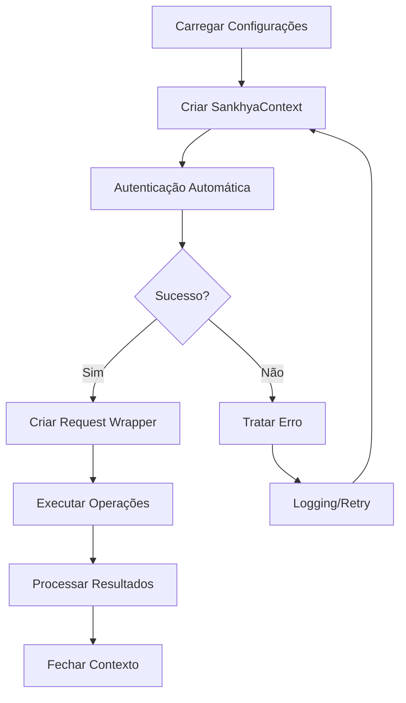

# Início Rápido

Este guia mostra como criar sua primeira integração com a API Sankhya usando o SDK Python.

## Exemplo "Hello World"

O exemplo mais simples de uso do SDK:

```python
from sankhya_sdk.auth.oauth_client import OAuthClient
from sankhya_sdk.http.session import SankhyaSession
from dotenv import load_dotenv
import os

load_dotenv()

# 1. Configurar Cliente OAuth
oauth = OAuthClient(
    base_url=os.getenv("SANKHYA_AUTH_BASE_URL", "https://api.sankhya.com.br"),
    token=os.getenv("SANKHYA_TOKEN")
)

# 2. Autenticar
oauth.authenticate(
    client_id=os.getenv("SANKHYA_CLIENT_ID"),
    client_secret=os.getenv("SANKHYA_CLIENT_SECRET")
)

# 3. Criar Sessão
session = SankhyaSession(oauth_client=oauth)

print("Conectado com sucesso via OAuth2!")
response = session.get("/gateway/v1/mge/teste")
print(f"Status: {response.status_code}")
```

## Sua Primeira Consulta

### Abordagem Moderna: Gateway Client (Recomendada)

O `GatewayClient` oferece uma interface simplificada para a API JSON:

```python
from sankhya_sdk.auth import OAuthClient
from sankhya_sdk.http import SankhyaSession, GatewayClient
from dotenv import load_dotenv
import os

load_dotenv()

# 1. Configurar OAuth
oauth = OAuthClient(
    base_url=os.getenv("SANKHYA_BASE_URL", "https://api.sankhya.com.br"),
    token=os.getenv("SANKHYA_TOKEN")
)

# 2. Autenticar
oauth.authenticate(
    client_id=os.getenv("SANKHYA_CLIENT_ID"),
    client_secret=os.getenv("SANKHYA_CLIENT_SECRET")
)

# 3. Criar sessão e cliente
session = SankhyaSession(oauth_client=oauth)
client = GatewayClient(session)

# 4. Consultar parceiros
result = client.load_records(
    entity="Parceiro",
    fields=["CODPARC", "NOMEPARC", "CGC_CPF"],
    criteria="ATIVO = 'S' AND CLIENTE = 'S'"
)

# 5. Processar resultados
entities = result.get("responseBody", {}).get("entities", {})
records = entities.get("entity", [])

# Garantir lista
if isinstance(records, dict):
    records = [records]

for record in records:
    codigo = record.get("CODPARC", {}).get("$")
    nome = record.get("NOMEPARC", {}).get("$")
    print(f"{codigo}: {nome}")
```

!!! tip "Recomendação"
    Para novos projetos, use o `GatewayClient` com DTOs. Esta é a abordagem mais moderna e oferece melhor performance.

### Abordagem Clássica: SankhyaContext (Legado)

Vamos buscar dados de parceiros (clientes/fornecedores):

```python
from sankhya_sdk import SankhyaContext
from sankhya_sdk.request_wrappers import SimpleCRUDRequestWrapper
from sankhya_sdk.transport_entities import Partner
from dotenv import load_dotenv

load_dotenv()

with SankhyaContext.from_settings() as ctx:
    # Cria o wrapper CRUD
    crud = SimpleCRUDRequestWrapper(ctx.wrapper)
    
    # Busca os 10 primeiros parceiros
    partners = crud.find(
        entity_type=Partner,
        criteria="CODPARC > 0",
        max_results=10
    )
    
    # Exibe resultados
    for partner in partners:
        print(f"Código: {partner.code_partner}")
        print(f"Nome: {partner.name}")
        print("-" * 40)
```

## Entendendo o Código

### 1. Context Manager

O `SankhyaContext` gerencia o ciclo de vida da conexão:

```python
with SankhyaContext.from_settings() as ctx:
    # Conexão automaticamente aberta
    ...
# Conexão automaticamente fechada (logout)
```

!!! tip "Boas Práticas"
    Sempre use o context manager (`with`) para garantir que a sessão seja fechada corretamente, mesmo em caso de exceções.

### 2. Request Wrappers

O SDK fornece wrappers de alto nível para operações comuns:

| Wrapper | Descrição |
|---------|-----------|
| `SimpleCRUDRequestWrapper` | Operações CRUD básicas |
| `PagedRequestWrapper` | Consultas paginadas para grandes volumes |
| `OnDemandRequestWrapper` | Processamento em lote assíncrono |
| `KnowServicesRequestWrapper` | Serviços específicos (NF-e, faturamento, etc.) |

### 3. Transport Entities

Entidades pré-definidas para interação com a API:

```python
from sankhya_sdk.transport_entities import (
    Partner,        # Parceiros (clientes/fornecedores)
    Product,        # Produtos
    InvoiceHeader,  # Cabeçalho de notas fiscais
    # ... e mais
)
```

## Exemplo Completo: CRUD de Parceiros

### Buscar (Find)

```python
from sankhya_sdk import SankhyaContext
from sankhya_sdk.request_wrappers import SimpleCRUDRequestWrapper
from sankhya_sdk.transport_entities import Partner
from sankhya_sdk.helpers import EntityQueryOptions

with SankhyaContext.from_settings() as ctx:
    crud = SimpleCRUDRequestWrapper(ctx.wrapper)
    
    # Busca simples
    partners = crud.find(Partner, "CODPARC = 1")
    
    # Busca com opções avançadas
    options = EntityQueryOptions(
        include_fields=["CODPARC", "NOMEPARC", "CGC_CPF"],
        order_by="NOMEPARC",
        max_results=100
    )
    partners = crud.find_with_options(Partner, "ATIVO = 'S'", options)
```

### Atualizar (Update)

```python
with SankhyaContext.from_settings() as ctx:
    crud = SimpleCRUDRequestWrapper(ctx.wrapper)
    
    # Busca o parceiro
    partners = crud.find(Partner, "CODPARC = 1")
    
    if partners:
        partner = partners[0]
        partner.email = "novo@email.com"
        
        # Atualiza
        result = crud.update(partner)
        print(f"Parceiro atualizado: {result}")
```

### Criar (Insert)

```python
with SankhyaContext.from_settings() as ctx:
    crud = SimpleCRUDRequestWrapper(ctx.wrapper)
    
    # Cria novo parceiro
    new_partner = Partner()
    new_partner.name = "Novo Cliente LTDA"
    new_partner.cgc_cpf = "12345678000199"
    new_partner.type_partner = "C"  # Cliente
    
    # Insere
    result = crud.insert(new_partner)
    print(f"Parceiro criado com código: {result.code_partner}")
```

### Remover (Delete)

```python
with SankhyaContext.from_settings() as ctx:
    crud = SimpleCRUDRequestWrapper(ctx.wrapper)
    
    # Remove parceiro
    partner = Partner()
    partner.code_partner = 999  # ID do parceiro a remover
    
    result = crud.remove(partner)
    print(f"Parceiro removido: {result}")
```

## Tratamento de Erros

Sempre trate exceções para uma integração robusta:

```python
from sankhya_sdk import SankhyaContext
from sankhya_sdk.exceptions import (
    SankhyaException,
    ServiceRequestException,
    ServiceRequestInvalidAuthorizationException,
)

try:
    with SankhyaContext.from_settings() as ctx:
        crud = SimpleCRUDRequestWrapper(ctx.wrapper)
        partners = crud.find(Partner, "CODPARC > 0")
        
except ServiceRequestInvalidAuthorizationException:
    print("Erro: Credenciais inválidas")
    
except ServiceRequestException as e:
    print(f"Erro na requisição: {e.message}")
    print(f"Status: {e.status_message}")
    
except SankhyaException as e:
    print(f"Erro geral do SDK: {e}")
    
except Exception as e:
    print(f"Erro inesperado: {e}")
```

## Logging

O SDK suporta logging integrado:

```python
import logging

# Configura logging
logging.basicConfig(
    level=logging.DEBUG,
    format='%(asctime)s - %(name)s - %(levelname)s - %(message)s'
)

# O SDK usará o logger 'sankhya_sdk'
logger = logging.getLogger('sankhya_sdk')
logger.setLevel(logging.DEBUG)

with SankhyaContext.from_settings() as ctx:
    # Logs detalhados serão exibidos
    ...
```

## Fluxo Típico de Integração



## Próximos Passos

- [Autenticação](authentication.md) - Métodos avançados de autenticação
- [Arquitetura](../core-concepts/architecture.md) - Entenda a arquitetura do SDK
- [Exemplos](../examples/index.md) - Mais exemplos práticos
- [Referência da API](../api-reference/index.md) - Documentação completa
