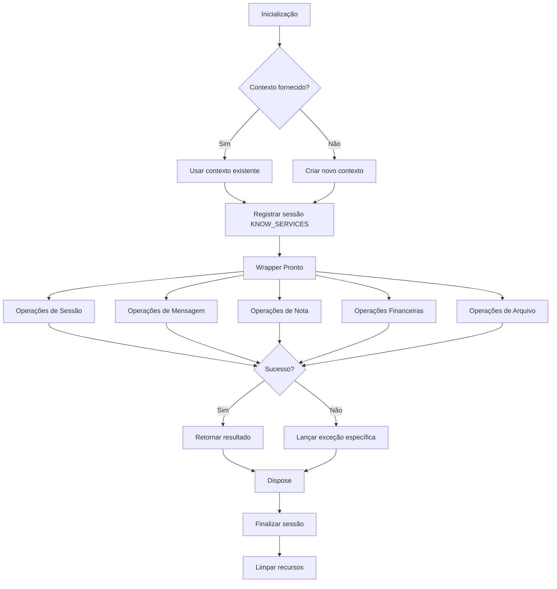

# KnowServicesRequestWrapper

O `KnowServicesRequestWrapper` fornece métodos de conveniência para serviços conhecidos (known services) da API Sankhya, facilitando operações comuns como gerenciamento de sessões, mensagens, notas fiscais, operações financeiras e arquivos.

## Visão Geral

Esta classe foi migrada do SDK .NET (`Sankhya-SDK-dotnet/Src/Sankhya/RequestWrappers/KnowServicesRequestWrapper.cs`) e implementa o mesmo padrão de extensões estáticas utilizado no C#, adaptado para Python como métodos de classe.

### Características

- **Gerenciamento de Sessão**: Sessão dedicada do tipo `KNOW_SERVICES`
- **Context Manager**: Suporte a `with` e `async with` para gerenciamento automático de recursos
- **Métodos Síncronos e Assíncronos**: Operações de I/O disponíveis em ambas versões
- **Logging Detalhado**: Logs em níveis INFO, DEBUG e WARNING
- **Tratamento de Exceções**: Exceções específicas para cada tipo de operação

## Início Rápido

### Inicialização Manual

```python
from sankhya_sdk.request_wrappers import KnowServicesRequestWrapper

# Inicializar
KnowServicesRequestWrapper.initialize()

try:
    # Usar os métodos
    sessions = KnowServicesRequestWrapper.get_sessions()
    print(f"Sessões ativas: {len(sessions)}")
finally:
    # Sempre limpar recursos
    KnowServicesRequestWrapper.dispose()
```

### Com Context Manager

```python
from sankhya_sdk.request_wrappers import KnowServicesRequestWrapper

with KnowServicesRequestWrapper():
    # Sessão gerenciada automaticamente
    sessions = KnowServicesRequestWrapper.get_sessions()
    
    # Criar nota fiscal
    nunota = KnowServicesRequestWrapper.create_invoice(header, items)
# Recursos liberados automaticamente
```

### Com Contexto Existente

```python
from sankhya_sdk.core.context import SankhyaContext
from sankhya_sdk.request_wrappers import KnowServicesRequestWrapper

# Usar contexto já existente
ctx = SankhyaContext.from_settings()
KnowServicesRequestWrapper.initialize(ctx)

try:
    # Operações...
    pass
finally:
    KnowServicesRequestWrapper.dispose()
```

## Categorias de Métodos

### Gerenciamento de Sessões

| Método | Descrição |
|--------|-----------|
| `get_sessions()` | Retorna lista de todas as sessões ativas |
| `kill_session(session_id)` | Finaliza uma sessão específica |

```python
# Obter todas as sessões
sessions = KnowServicesRequestWrapper.get_sessions()
for session in sessions:
    print(f"Usuário: {session.user_name}")

# Finalizar uma sessão
KnowServicesRequestWrapper.kill_session("ABC123XYZ")
```

### Mensagens e Avisos

| Método | Descrição |
|--------|-----------|
| `send_warning(title, description, ...)` | Envia um aviso do sistema |
| `send_message(content, recipients)` | Envia uma mensagem |
| `receive_messages()` | Recebe novas mensagens |

```python
from sankhya_sdk.enums import SankhyaWarningLevel

# Enviar aviso
KnowServicesRequestWrapper.send_warning(
    title="Manutenção Agendada",
    description="Sistema ficará offline das 22h às 23h",
    level=SankhyaWarningLevel.WARNING
)

# Enviar mensagem
KnowServicesRequestWrapper.send_message(
    content="Backup concluído com sucesso!"
)

# Receber mensagens
messages = KnowServicesRequestWrapper.receive_messages()
```

### Operações de Nota Fiscal (CRUD)

| Método | Descrição | Retorno |
|--------|-----------|---------|
| `create_invoice(header, items)` | Cria nova nota | `int` (NUNOTA) |
| `remove_invoice(single_number)` | Remove nota | `None` |
| `add_invoice_items(single_number, items)` | Adiciona itens | `int` (sequência) |
| `remove_invoice_items(items)` | Remove itens | `None` |

```python
from sankhya_sdk.models.service.invoice_types import Invoice, InvoiceItem

# Criar nota fiscal
header = Invoice(partner_code=123, top_code=1)
items = [
    InvoiceItem(product_code="PROD001", quantity=10, unit_price=100.0),
    InvoiceItem(product_code="PROD002", quantity=5, unit_price=50.0),
]
nunota = KnowServicesRequestWrapper.create_invoice(header, items)
print(f"Nota criada: NUNOTA={nunota}")

# Adicionar itens
new_items = [InvoiceItem(product_code="PROD003", quantity=2)]
seq = KnowServicesRequestWrapper.add_invoice_items(nunota, new_items)

# Remover nota
KnowServicesRequestWrapper.remove_invoice(nunota)
```

### Operações de Faturamento

| Método | Descrição | Retorno |
|--------|-----------|---------|
| `bill(...)` | Fatura uma nota | `Tuple[int, List[ClientEvent]]` |
| `confirm_invoice(single_number)` | Confirma nota | `None` |
| `duplicate_invoice(...)` | Duplica nota | `int` (novo NUNOTA) |

```python
from sankhya_sdk.enums import BillingType

# Faturar nota
nunota_faturado, eventos = KnowServicesRequestWrapper.bill(
    single_number=12345,
    code_operation_type=1,
    billing_type=BillingType.NORMAL,
)

# Confirmar nota
KnowServicesRequestWrapper.confirm_invoice(12345)

# Duplicar nota
novo_nunota = KnowServicesRequestWrapper.duplicate_invoice(
    single_number=12345,
    code_operation_type=2,
    should_update_price=True,
)
```

### Operações de Status de Nota

| Método | Descrição |
|--------|-----------|
| `flag_invoices_as_not_pending(single_numbers)` | Marca como não pendente |
| `get_invoice_accompaniments(single_numbers)` | Obtém acompanhamentos |
| `cancel_invoices(single_numbers, justification)` | Cancela notas |
| `bind_invoice_with_order(...)` | Vincula a pedido |

```python
# Marcar como não pendente
KnowServicesRequestWrapper.flag_invoices_as_not_pending([123, 456, 789])

# Obter acompanhamentos
invoices = KnowServicesRequestWrapper.get_invoice_accompaniments([123])

# Cancelar notas
total, nao_canceladas = KnowServicesRequestWrapper.cancel_invoices(
    single_numbers=[123, 456],
    justification="Erro de digitação"
)
```

### Operações NFe

| Método | Descrição |
|--------|-----------|
| `get_fiscal_invoice_authorization(single_numbers)` | Busca autorização NF-e |
| `generate_lot(single_numbers)` | Gera lote NF-e |

```python
# Buscar autorização
KnowServicesRequestWrapper.get_fiscal_invoice_authorization([123, 456])

# Gerar lote
KnowServicesRequestWrapper.generate_lot([123, 456])
```

### Operações Financeiras

| Método | Descrição |
|--------|-----------|
| `flag_as_payments_paid(financial_numbers, code_account)` | Marca como pago |
| `reverse_payments(financial_numbers)` | Estorna pagamentos |
| `unlink_shipping(financial_number)` | Desvincula remessa |

```python
# Marcar como pago
KnowServicesRequestWrapper.flag_as_payments_paid(
    financial_numbers=[1001, 1002],
    code_account=123
)

# Estornar pagamentos
KnowServicesRequestWrapper.reverse_payments([1001, 1002])

# Desvincular remessa
KnowServicesRequestWrapper.unlink_shipping(1001)
```

### Operações de Arquivo

| Método | Descrição | Retorno |
|--------|-----------|---------|
| `open_file(path)` | Abre arquivo | `str` (chave) |
| `delete_files(paths)` | Deleta arquivos | `None` |
| `get_file(key)` | Baixa arquivo | `ServiceFile` |
| `get_file_async(key)` | Baixa arquivo (async) | `ServiceFile` |

```python
# Abrir arquivo
key = KnowServicesRequestWrapper.open_file("/caminho/arquivo.pdf")

# Baixar arquivo
file = KnowServicesRequestWrapper.get_file(key)
with open("local.pdf", "wb") as f:
    f.write(file.data)

# Deletar arquivos
KnowServicesRequestWrapper.delete_files(["/caminho/arquivo1.pdf"])
```

### Operações de Imagem

| Método | Descrição | Retorno |
|--------|-----------|---------|
| `get_image(entity)` | Obtém imagem da entidade | `ServiceFile` |
| `get_image_async(entity)` | Obtém imagem (async) | `ServiceFile` |

```python
from sankhya_sdk.models.transport import Product

# Obter imagem do produto
product = Product(code=123)
image = KnowServicesRequestWrapper.get_image(product)

with open("produto.jpg", "wb") as f:
    f.write(image.data)
```

## Tratamento de Exceções

O wrapper lança exceções específicas para diferentes tipos de erro:

| Exceção | Cenário |
|---------|---------|
| `RuntimeError` | Wrapper não inicializado |
| `ValueError` | Parâmetros inválidos |
| `NoItemsConfirmInvoiceException` | Confirmar nota sem itens |
| `ConfirmInvoiceException` | Erro na confirmação |
| `MarkAsPaymentPaidException` | Erro na baixa de título |
| `UnlinkShippingException` | Erro ao desvincular remessa |

```python
from sankhya_sdk.exceptions import (
    NoItemsConfirmInvoiceException,
    ConfirmInvoiceException,
)

try:
    KnowServicesRequestWrapper.confirm_invoice(12345)
except NoItemsConfirmInvoiceException:
    print("Nota não possui itens para confirmação")
except ConfirmInvoiceException as e:
    print(f"Erro ao confirmar: {e}")
```

## Comparação com SDK .NET

| C# (.NET) | Python |
|-----------|--------|
| `KnowServicesRequestWrapper.GetSessions()` | `KnowServicesRequestWrapper.get_sessions()` |
| `KnowServicesRequestWrapper.KillSession(id)` | `KnowServicesRequestWrapper.kill_session(id)` |
| `KnowServicesRequestWrapper.SendWarning(...)` | `KnowServicesRequestWrapper.send_warning(...)` |
| `KnowServicesRequestWrapper.CreateInvoice(...)` | `KnowServicesRequestWrapper.create_invoice(...)` |
| `KnowServicesRequestWrapper.Bill(...)` | `KnowServicesRequestWrapper.bill(...)` |
| `KnowServicesRequestWrapper.ConfirmInvoice(n)` | `KnowServicesRequestWrapper.confirm_invoice(n)` |
| `KnowServicesRequestWrapper.GetFile(key)` | `KnowServicesRequestWrapper.get_file(key)` |

## Diagrama de Fluxo



## Notas de Implementação

1. **Thread Safety**: A classe usa atributos de classe estáticos, então não é thread-safe. Para uso em múltiplas threads, considere usar instâncias separadas ou locks.

2. **Timestamps**: O método `receive_messages()` atualiza internamente um timestamp para rastrear a última verificação.

3. **Exceções Silenciadas**: O método `confirm_invoice()` ignora silenciosamente erros de "nota já confirmada".

4. **Operações Individuais**: O método `reverse_payments()` faz requisições individuais para cada título, não em lote.
