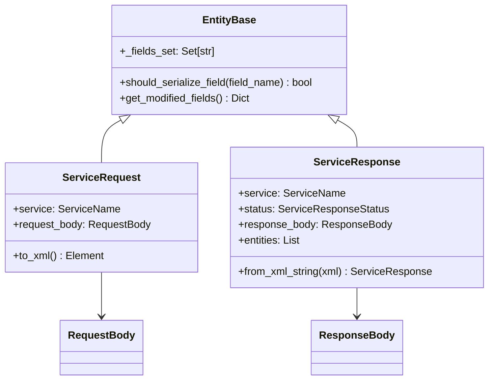

# Service Models - Sankhya SDK Python

Documentação dos modelos de serviço para comunicação com a API Sankhya.

## Visão Geral

Este módulo implementa a camada de serialização XML para comunicação com os web services Sankhya, migrada do SDK .NET original.

## Arquitetura



## Classes Principais

### ServiceRequest

Encapsula uma requisição para a API:

```python
from sankhya_sdk.models.service import ServiceRequest, Entity, Field
from sankhya_sdk.enums import ServiceName

request = ServiceRequest(service=ServiceName.CRUD_FIND)
request.request_body.entity = Entity(
    name="Parceiro",
    fields=[Field(name="CODPARC"), Field(name="NOMEPARC")]
)

xml = request.to_xml_string()
```

### ServiceResponse

Processa respostas da API:

```python
from sankhya_sdk.models.service import ServiceResponse

response = ServiceResponse.from_xml_string(xml_response)

if response.is_success:
    for entity in response.entities:
        print(entity.get("CODPARC"))
else:
    print(f"Erro: {response.status_message_text}")
```

## Mapeamento .NET → Python

| Classe .NET | Classe Python | Módulo |
|-------------|---------------|--------|
| ServiceRequest | ServiceRequest | service_request.py |
| ServiceResponse | ServiceResponse | service_response.py |
| RequestBody | RequestBody | request_body.py |
| ResponseBody | ResponseBody | response_body.py |
| Entity | Entity | entity_types.py |
| DataSet | DataSet | entity_types.py |
| Field | Field | basic_types.py |
| Criteria | Criteria | basic_types.py |
| Parameter | Parameter | basic_types.py |
| LiteralCriteria | LiteralCriteria | basic_types.py |
| StatusMessage | StatusMessage | metadata_types.py |

## Serialização XML

A serialização usa `lxml.etree` para máximo controle:

```python
from lxml import etree
from sankhya_sdk.models.service import create_xml_element, serialize_bool

# Criar elemento
elem = create_xml_element("field", "valor", {"name": "CODPROD"})

# Serializar bool
elem.set("active", serialize_bool(True))  # "true"
```

## Exemplo Completo

```python
from sankhya_sdk.models.service import (
    ServiceRequest,
    ServiceResponse,
    Entity,
    Field,
    LiteralCriteria,
    Parameter,
)
from sankhya_sdk.enums import ServiceName, ParameterType

# Criar requisição
request = ServiceRequest(service=ServiceName.CRUD_FIND)
request.request_body.entity = Entity(
    name="Produto",
    fields=[
        Field(name="CODPROD"),
        Field(name="DESCRPROD"),
        Field(name="VLRVENDA"),
    ],
    literal_criteria=LiteralCriteria(
        expression="ATIVO = ?",
        parameters=[Parameter(type=ParameterType.TEXT, value="S")]
    )
)

# Obter XML
xml = request.to_xml_bytes()

# Processar resposta (após chamada HTTP)
response = ServiceResponse.from_xml_bytes(response_bytes)

if response.is_success:
    for produto in response.entities:
        print(f"{produto['CODPROD']}: {produto['DESCRPROD']}")
else:
    response.raise_for_status()  # Levanta exceção
```
