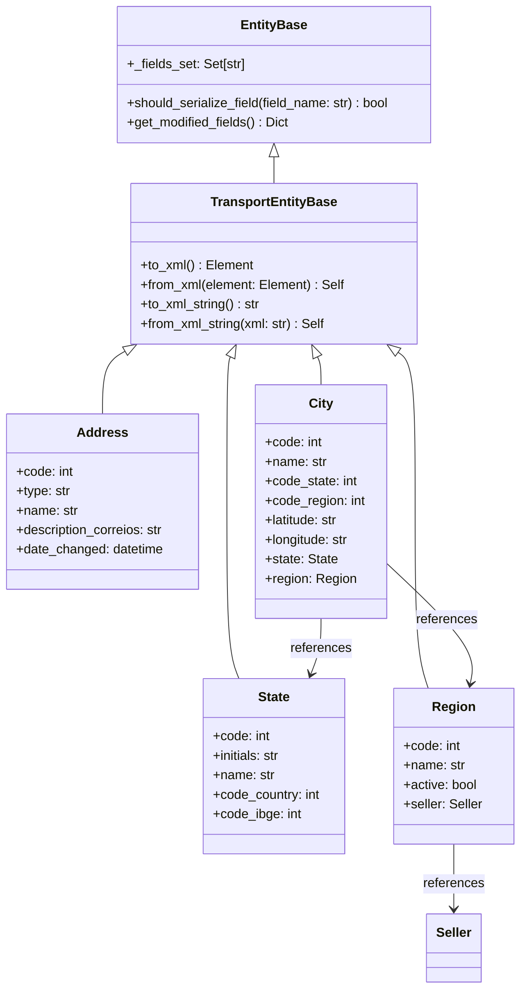

# Entidades de Transporte

Este documento descreve as entidades de transporte simples do SDK Sankhya Python, migradas do SDK .NET.

## Visão Geral

As entidades de transporte representam objetos de domínio do sistema Sankhya. Cada entidade:

- Herda de `TransportEntityBase` para serialização XML genérica
- Utiliza decoradores para mapear propriedades Python para elementos XML
- Implementa rastreamento de campos modificados via `_fields_set`
- Suporta comparação case-insensitive para strings
- Implementa `__eq__` e `__hash__` compatíveis com o SDK .NET

## Entidades Disponíveis

### Address (Endereço)

Representa um endereço no sistema Sankhya.

```python
from sankhya_sdk.models.transport import Address

# Criação
address = Address(
    code=1,
    type="Residencial",
    name="Rua Principal",
    description_correios="Descrição do Correio"
)

# Serialização XML
xml_string = address.to_xml_string()
# <Endereco>
#   <CODEND>1</CODEND>
#   <TIPO>Residencial</TIPO>
#   <NOMEEND>Rua Principal</NOMEEND>
#   <DESCRICAOCORREIO>Descrição do Correio</DESCRICAOCORREIO>
# </Endereco>

# Deserialização
restored = Address.from_xml_string(xml_string)
```

### State (Unidade Federativa)

Representa um estado/UF no sistema Sankhya.

```python
from sankhya_sdk.models.transport import State

# Criação
state = State(
    code=35,
    initials="SP",
    name="São Paulo",
    code_country=1058,
    code_ibge=35
)

# Serialização XML
xml_string = state.to_xml_string()
# <UnidadeFederativa>
#   <CODUF>35</CODUF>
#   <UF>SP</UF>
#   <DESCRICAO>São Paulo</DESCRICAO>
#   <CODPAIS>1058</CODPAIS>
#   <CODIBGE>35</CODIBGE>
# </UnidadeFederativa>
```

### Region (Região)

Representa uma região no sistema Sankhya. Inclui campo booleano com serialização "S"/"N".

```python
from sankhya_sdk.models.transport import Region

# Criação com campo active
region = Region(
    code=1,
    name="Sudeste",
    code_price_table=10
)
region.active = True  # Define active_internal como "S"

# Verificação
print(region.active)  # True
print(region.active_internal)  # "S"

# Serialização XML
xml_string = region.to_xml_string()
# <Regiao>
#   <CODREG>1</CODREG>
#   <CODTAB>10</CODTAB>
#   <ATIVA>S</ATIVA>
#   <NOMEREG>Sudeste</NOMEREG>
# </Regiao>
```

### City (Cidade)

Representa uma cidade no sistema Sankhya. Inclui relacionamentos com State e Region.

```python
from sankhya_sdk.models.transport import City, State, Region

# Criação com relacionamentos
state = State(code=35, initials="SP", name="São Paulo")
region = Region(code=1, name="Sudeste")

city = City(
    code=3550308,
    code_state=35,
    code_region=1,
    name="São Paulo",
    area_code=11,
    latitude="-23.5505",
    longitude="-46.6333",
    state=state,
    region=region
)

# Serialização XML (inclui entidades relacionadas)
xml_string = city.to_xml_string()
```

## Sistema de Rastreamento de Campos

Cada entidade rastreia quais campos foram definidos via `_fields_set`. Isso é equivalente ao padrão `_fieldSet` e `ShouldSerialize*()` do SDK .NET.

```python
from sankhya_sdk.models.transport import Address

# Somente campos passados no construtor são rastreados
address = Address(code=1, name="Rua A")

print("code" in address._fields_set)  # True
print("name" in address._fields_set)  # True
print("type" in address._fields_set)  # False (não definido)

# Campos atribuídos posteriormente são rastreados
address.type = "Comercial"
print("type" in address._fields_set)  # True

# Verificar se deve serializar um campo
print(address.should_serialize_field("code"))  # True
print(address.should_serialize_field("type"))  # True
print(address.should_serialize_field("description_correios"))  # False

# Obter campos modificados
modified = address.get_modified_fields()
# {"code": 1, "name": "Rua A", "type": "Comercial"}
```

## Serialização/Deserialização XML

### Serialização para XML

```python
from sankhya_sdk.models.transport import City

city = City(code=1, name="São Paulo")

# Para lxml.etree.Element
xml_element = city.to_xml()

# Para string XML
xml_string = city.to_xml_string()

# Com formatação (pretty print)
xml_formatted = city.to_xml_string(pretty_print=True)
```

### Deserialização de XML

```python
from lxml import etree
from sankhya_sdk.models.transport import City

# De string XML
xml_str = "<Cidade><CODCID>1</CODCID><NOMECID>São Paulo</NOMECID></Cidade>"
city = City.from_xml_string(xml_str)

# De elemento lxml
elem = etree.fromstring(xml_str)
city = City.from_xml(elem)
```

## Tabela de Mapeamento de Campos

### Address

| Propriedade Python | Elemento XML | Propriedade C# | Tipo Python | Observações |
|-------------------|--------------|----------------|-------------|-------------|
| `code` | `CODEND` | `Code` | `int` | Chave primária |
| `type` | `TIPO` | `Type` | `Optional[str]` | - |
| `name` | `NOMEEND` | `Name` | `Optional[str]` | Max 60 caracteres |
| `description_correios` | `DESCRICAOCORREIO` | `DescriptionCorreios` | `Optional[str]` | - |
| `date_changed` | `DTALTER` | `DateChanged` | `Optional[datetime]` | - |

### State

| Propriedade Python | Elemento XML | Propriedade C# | Tipo Python | Observações |
|-------------------|--------------|----------------|-------------|-------------|
| `code` | `CODUF` | `Code` | `int` | Chave primária |
| `initials` | `UF` | `Initials` | `Optional[str]` | Sigla UF |
| `name` | `DESCRICAO` | `Name` | `Optional[str]` | - |
| `code_country` | `CODPAIS` | `CodeCountry` | `Optional[int]` | - |
| `code_partner_secretary_of_state_revenue` | `CODPARCSECRECEST` | `CodePartnerSecretaryOfStateRevenue` | `Optional[int]` | - |
| `code_ibge` | `CODIBGE` | `CodeIbge` | `Optional[int]` | - |
| `code_revenue` | `CODSTGNRE` | `CodeRevenue` | `Optional[int]` | - |
| `code_revenue_detailing` | `CODDETGNRE` | `CodeRevenueDetailing` | `Optional[int]` | - |
| `code_product` | `CODPRODGNRE` | `CodeProduct` | `Optional[int]` | - |
| `agreement_protocol` | `PROTOCOLOCONVENIO` | `AgreementProtocol` | `Optional[str]` | - |

### Region

| Propriedade Python | Elemento XML | Propriedade C# | Tipo Python | Observações |
|-------------------|--------------|----------------|-------------|-------------|
| `code` | `CODREG` | `Code` | `int` | Chave primária |
| `code_region_father` | `CODREGPAI` | `CodeRegionFather` | `Optional[int]` | - |
| `code_price_table` | `CODTAB` | `CodePriceTable` | `Optional[int]` | - |
| `code_seller` | `CODVEND` | `CodeSeller` | `Optional[int]` | - |
| `active` | - | `Active` | `property -> bool` | Computado de `active_internal` |
| `active_internal` | `ATIVA` | `ActiveInternal` | `Optional[str]` | "S" ou "N" |
| `name` | `NOMEREG` | `Name` | `Optional[str]` | - |
| `seller` | - | `Seller` | `Optional[Seller]` | Relacionamento |

### City

| Propriedade Python | Elemento XML | Propriedade C# | Tipo Python | Observações |
|-------------------|--------------|----------------|-------------|-------------|
| `code` | `CODCID` | `Code` | `int` | Chave primária |
| `code_state` | `UF` | `CodeState` | `Optional[int]` | FK para State |
| `code_region` | `CODREG` | `CodeRegion` | `Optional[int]` | FK para Region |
| `code_fiscal` | `CODMUNFIS` | `CodeFiscal` | `Optional[int]` | - |
| `name` | `NOMECID` | `Name` | `Optional[str]` | - |
| `description_correios` | `DESCRICAOCORREIO` | `DescriptionCorreios` | `Optional[str]` | - |
| `area_code` | `DDD` | `AreaCode` | `Optional[int]` | - |
| `latitude` | `LATITUDE` | `Latitude` | `Optional[str]` | - |
| `longitude` | `LONGITUDE` | `Longitude` | `Optional[str]` | - |
| `state` | - | `State` | `Optional[State]` | Relacionamento |
| `region` | - | `Region` | `Optional[Region]` | Relacionamento |

## Diagrama de Relacionamentos



## Comparação e Hash

As entidades implementam `__eq__` e `__hash__` para uso em coleções:

```python
from sankhya_sdk.models.transport import Address

# Comparação case-insensitive para strings
addr1 = Address(code=1, name="RUA PRINCIPAL")
addr2 = Address(code=1, name="rua principal")

print(addr1 == addr2)  # True

# Uso em sets e dicts
addresses = {addr1, addr2}  # Contém apenas 1 elemento
print(len(addresses))  # 1
```

## Validação

Campos com `entity_custom_data(max_length=N)` são validados automaticamente:

```python
from sankhya_sdk.models.transport import Address

# Nome com 60 caracteres (OK)
address = Address(code=1, name="A" * 60)

# Nome com 61 caracteres (ValueError)
try:
    address = Address(code=1, name="A" * 61)
except ValueError as e:
    print(f"Erro: {e}")
```
