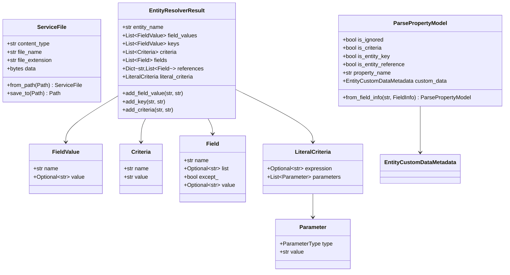

# ValueObjects

Este módulo contém objetos de valor (ValueObjects) que representam conceitos importantes do ecossistema Sankhya, usados principalmente para transferência de dados entre o SDK e os serviços da Sankhya.

## ServiceFile

Representa um arquivo que pode ser enviado para ou recebido de um serviço Sankhya.

### Propriedades
- `content_type`: Tipo MIME do arquivo (ex: `application/pdf`).
- `file_name`: Nome do arquivo com extensão.
- `file_extension`: Extensão do arquivo (sempre começa com `.`).
- `data`: Conteúdo binário do arquivo.

### Exemplo de Uso
```python
from pathlib import Path
from sankhya_sdk import ServiceFile

# Criar a partir de um arquivo local
sf = ServiceFile.from_path(Path("relatorio.pdf"))

# Salvar em um diretório
sf.save_to(Path("./downloads"))
```

## ParsePropertyModel

Modelo usado internamente para descrever como uma propriedade de uma entidade deve ser processada (parse) durante a resolução da entidade.

### Propriedades
- `is_ignored`: Se a propriedade deve ser ignorada.
- `is_criteria`: Se pode ser usada como critério de busca.
- `is_entity_key`: Se é uma chave primária.
- `is_entity_reference`: Se é uma referência para outra entidade.
- `property_name`: Nome da propriedade no Sankhya (mapeado pelo decorator `@entity_element`).
- `custom_data`: Metadados customizados (como tamanho máximo).

## EntityResolverResult

Resultado consolidado da análise de uma instância de entidade, preparando-a para ser enviada em uma requisição de serviço.

### Métodos Principais
- `add_field_value(name, value)`: Adiciona um valor de campo.
- `add_key(name, value)`: Adiciona uma chave primária.
- `add_criteria(name, value)`: Adiciona um critério de filtragem.
- `add_field(name)`: Adiciona um campo na lista de campos a retornar.
- `add_reference(relation_name, field_name)`: Adiciona um campo de uma entidade relacionada.

## Diagrama de Relacionamentos



## Comparativo .NET vs Python

| .NET SDK | Python SDK | Observação |
|----------|------------|------------|
| `ServiceFile` | `ServiceFile` | Implementado como Pydantic model. |
| `ParsePropertyModel` | `ParsePropertyModel` | Integrado com metadados Pydantic. |
| `EntityResolverResult` | `EntityResolverResult` | Dataclass com coleções tipadas. |
| `FieldValue` | `FieldValue` | Comparação case-insensitive no Python. |
| `Criteria` | `Criteria` | Campos opcionais. |
| `Field` | `Field` | Usa `except_` para evitar palavra reservada. |
