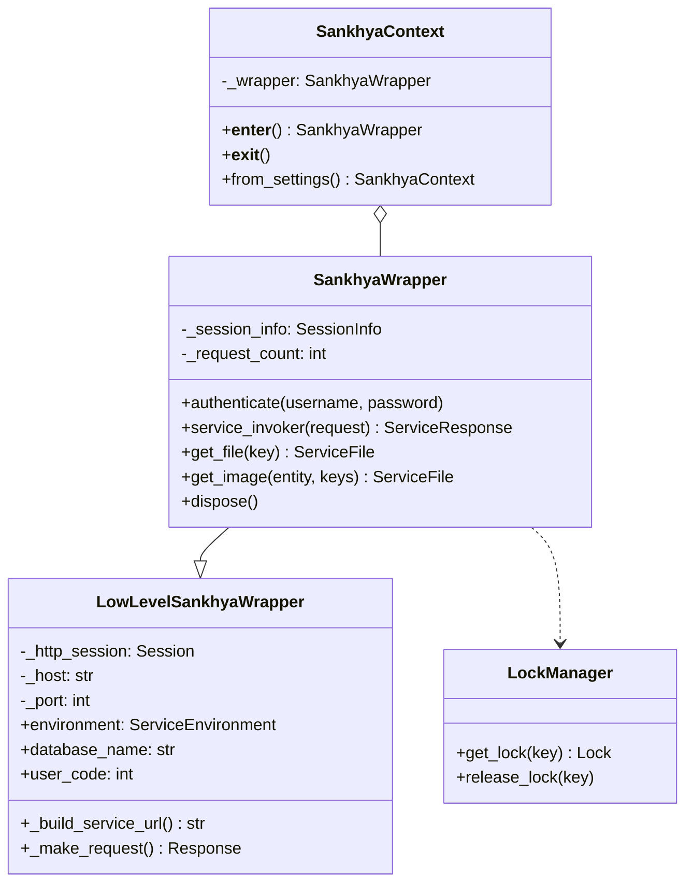
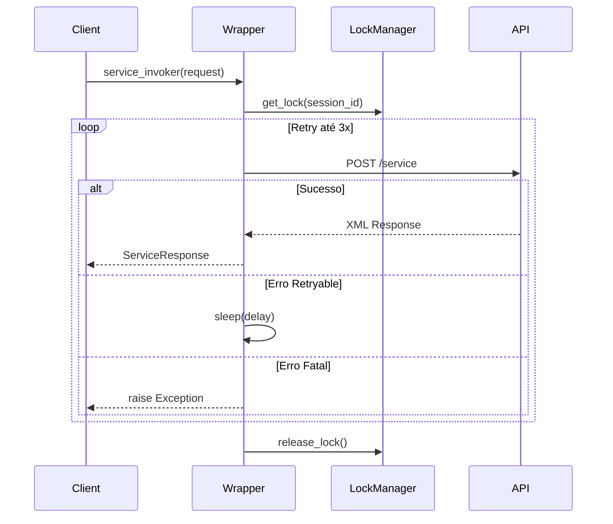

# SankhyaWrapper - Comunicação HTTP com a API Sankhya

Este módulo fornece classes para gerenciar a comunicação HTTP com a API Sankhya,
incluindo autenticação, retry automático e tratamento de exceções.

## Visão Geral da Arquitetura



## Uso Básico

### Quick Start

A forma mais simples de usar o SDK é através do `SankhyaContext`:

```python
from sankhya_sdk.core import SankhyaContext
from sankhya_sdk.enums import ServiceName
from sankhya_sdk.models.service import ServiceRequest

# Usando context manager (recomendado)
with SankhyaContext.from_settings() as wrapper:
    request = ServiceRequest(service=ServiceName.CRUD_FIND)
    # Configurar request...
    response = wrapper.service_invoker(request)
    
    if response.is_success:
        for entity in response.entities:
            print(entity)
```

### Configuração via .env

O SDK carrega configurações automaticamente de variáveis de ambiente:

```env
SANKHYA_URL=http://servidor-sankhya.exemplo.com
SANKHYA_PORT=8180
SANKHYA_USERNAME=usuario@empresa.com
SANKHYA_PASSWORD=senha_segura
SANKHYA_TIMEOUT=30
SANKHYA_MAX_RETRIES=3
```

### Configuração Manual

Você também pode configurar o wrapper manualmente:

```python
from sankhya_sdk.core import SankhyaWrapper

wrapper = SankhyaWrapper(
    host="http://servidor-sankhya.exemplo.com",
    port=8180,
    timeout=30,
    max_retries=3,
)

wrapper.authenticate("usuario", "senha")

try:
    # Usar o wrapper...
    pass
finally:
    wrapper.dispose()
```

## Classes Principais

### SankhyaWrapper

A classe principal que gerencia toda a comunicação com a API Sankhya.

#### Propriedades

| Propriedade | Tipo | Descrição |
|-------------|------|-----------|
| `is_authenticated` | `bool` | Se há uma sessão ativa |
| `session_id` | `Optional[str]` | ID da sessão atual |
| `user_code` | `int` | Código do usuário autenticado |
| `environment` | `ServiceEnvironment` | Ambiente de serviço |
| `request_count` | `int` | Número de requisições realizadas |

#### Métodos

##### `authenticate(username: str, password: str) -> None`

Autentica no servidor Sankhya e inicia uma sessão.

```python
wrapper.authenticate("usuario@empresa.com", "senha")
```

##### `service_invoker(request: ServiceRequest) -> ServiceResponse`

Invoca um serviço no Sankhya com retry automático.

```python
request = ServiceRequest(service=ServiceName.CRUD_FIND)
response = wrapper.service_invoker(request)
```

##### `service_invoker_async(request: ServiceRequest) -> ServiceResponse`

Versão assíncrona do `service_invoker`.

```python
response = await wrapper.service_invoker_async(request)
```

##### `get_file(key: str) -> ServiceFile`

Baixa um arquivo do repositório Sankhya.

```python
file = wrapper.get_file("CHAVE_ARQUIVO")
with open(file.filename or "arquivo.pdf", "wb") as f:
    f.write(file.data)
```

##### `get_image(entity: str, keys: Dict[str, Any]) -> Optional[ServiceFile]`

Baixa uma imagem associada a uma entidade.

```python
image = wrapper.get_image("Parceiro", {"CODPARC": 1})
if image:
    with open(f"parceiro.{image.file_extension}", "wb") as f:
        f.write(image.data)
```

##### `dispose() -> None`

Libera recursos e encerra a sessão.

```python
wrapper.dispose()
```

### SankhyaContext

Context manager para gerenciamento automático do ciclo de vida do wrapper.

#### Uso Síncrono

```python
with SankhyaContext.from_settings() as wrapper:
    # Usar wrapper...
    pass
# dispose() é chamado automaticamente
```

#### Uso Assíncrono

```python
async with SankhyaContext.from_settings() as wrapper:
    response = await wrapper.service_invoker_async(request)
```

### LockManager

Gerenciador de locks thread-safe para operações concorrentes.

```python
from sankhya_sdk.core import LockManager

lock = LockManager.get_lock("session_123")
with lock:
    # Operação protegida
    pass
```

## Tipos Auxiliares

### SessionInfo

Armazena informações da sessão autenticada.

```python
from sankhya_sdk.core.types import SessionInfo

session = SessionInfo(
    session_id="ABC123",
    user_code=42,
    username="admin",
    password="secret",
)
```

### ServiceFile

Representa um arquivo baixado do Sankhya.

```python
from sankhya_sdk.core.types import ServiceFile

# Retornado por get_file() e get_image()
file = wrapper.get_file("KEY")
print(file.content_type)     # "application/pdf"
print(file.file_extension)   # "pdf"
print(file.filename)         # "documento.pdf"
print(len(file.data))        # Tamanho em bytes
```

## Sistema de Retry

O wrapper implementa retry automático com backoff exponencial para diferentes tipos de erro:

### Delays por Tipo de Erro

| Tipo de Erro | Delay | Descrição |
|--------------|-------|-----------|
| Timeout | 10s (FREE) | Sistema saudável, erro transitório |
| Deadlock | 15s (STABLE) | Sistema estável mas com carga |
| Unavailable | 30s (UNSTABLE) | Sistema com problemas intermitentes |
| Inaccessible | 90s (BREAKDOWN) | Sistema em recuperação |

### Comportamento

1. **Máximo de retries**: 3 tentativas (configurável via `max_retries`)
2. **Reautenticação automática**: Em caso de sessão expirada
3. **Thread-safe**: Locks por sessão garantem operações seguras



## Tratamento de Exceções

O wrapper trata automaticamente as seguintes exceções:

| Exceção | Ação | Retry |
|---------|------|-------|
| `ServiceRequestInvalidAuthorizationException` | Reautentica | Sim |
| `ServiceRequestTimeoutException` | Aguarda 10s | Sim |
| `ServiceRequestDeadlockException` | Aguarda 15s | Sim |
| `ServiceRequestUnavailableException` | Aguarda 30s | Sim |
| `ServiceRequestInaccessibleException` | Reautentica + 90s | Sim |
| `ServiceRequestCompetitionException` | Reautentica | Sim |
| Outras exceções | Propaga | Não |

## Thread-Safety

O `SankhyaWrapper` é thread-safe e pode ser usado em aplicações concorrentes:

```python
import threading
from sankhya_sdk.core import SankhyaContext

def worker(wrapper, thread_id):
    request = ServiceRequest(service=ServiceName.CRUD_FIND)
    response = wrapper.service_invoker(request)
    print(f"Thread {thread_id}: {len(response.entities)} entidades")

with SankhyaContext.from_settings() as wrapper:
    threads = [
        threading.Thread(target=worker, args=(wrapper, i))
        for i in range(5)
    ]
    
    for t in threads:
        t.start()
    for t in threads:
        t.join()
```

## Ambientes de Serviço

O ambiente é determinado automaticamente pela porta:

| Porta | Ambiente | Uso |
|-------|----------|-----|
| 8180 | Production | Ambiente de produção |
| 8280 | Sandbox | Ambiente de testes |
| 8380 | Training | Ambiente de treinamento |

Você pode especificar manualmente:

```python
from sankhya_sdk.enums import ServiceEnvironment

wrapper = SankhyaWrapper(
    host="http://exemplo.com",
    port=9999,  # Porta customizada
    environment=ServiceEnvironment.SANDBOX,
)
```

## Constantes

O módulo `sankhya_sdk.core.constants` expõe constantes úteis:

```python
from sankhya_sdk.core import (
    DEFAULT_TIMEOUT,        # 30 segundos
    MAX_RETRY_COUNT,        # 3 tentativas
    MIME_TYPES_TO_EXTENSIONS,  # Mapeamento de MIME types
)
```
